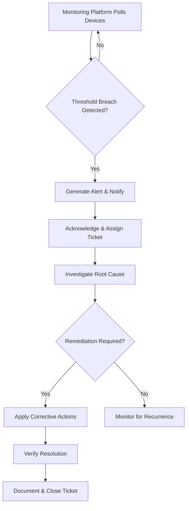

# Network Monitoring Procedure

**Version:** 1.0  
**Effective Date:** [Date]  
**Last Reviewed:** [Date]

## 1. Purpose

To establish a standardized process for monitoring network infrastructure, detecting anomalies, and responding to performance or security events.

## 2. Scope

This procedure applies to all network devices and services, including routers, switches, firewalls, wireless controllers, VPN gateways, and related infrastructure.

## 3. Monitoring Tools and Metrics

*   **Tools:**
    *   Network monitoring platform (e.g., Nagios, Zabbix, SolarWinds).
    *   Flow analysis tools (e.g., NetFlow, sFlow).
    *   SNMP collectors and syslog servers.
*   **Key Metrics:**
    *   Device availability (ping, SNMP status).
    *   Interface utilization (bandwidth in/out).
    *   Packet loss and latency.
    *   CPU and memory usage.
    *   Error rates and discards.
    *   Security events (e.g., port scans, unusual traffic spikes).

## 4. Setup and Configuration

1.  **Device Enrollment:**  
    *   Add network devices to the monitoring platform with SNMP credentials or agent.
    *   Define polling intervals and metric thresholds.
2.  **Alert Profiles:**  
    *   Configure alerts for each metric based on severity: Warning, Critical.
    *   Set notification channels (email, SMS, ticket creation in ITSM).
3.  **Dashboards and Reports:**  
    *   Create real-time dashboards for network health.
    *   Schedule regular performance reports (daily, weekly, monthly).

## 5. Monitoring Workflow

1.  **Data Collection:**  
    *   Monitoring platform polls devices at defined intervals.
2.  **Threshold Evaluation:**  
    *   Metrics are compared against thresholds to determine alert conditions.
3.  **Alert Generation:**  
    *   On threshold breach, alerts are created and notifications are sent.
4.  **Alert Triage:**  
    *   Network Operations team acknowledges the alert, determines severity, and assigns a ticket.
5.  **Investigation & Remediation:**  
    *   Investigate root cause (e.g., misconfiguration, hardware degradation, security event).
    *   Apply corrective actions (e.g., reconfigure device, replace hardware, block traffic).
6.  **Resolution & Closure:**  
    *   Verify the issue is resolved.
    *   Document remediation steps in the ticket and close.

## 6. Workflow Diagram

