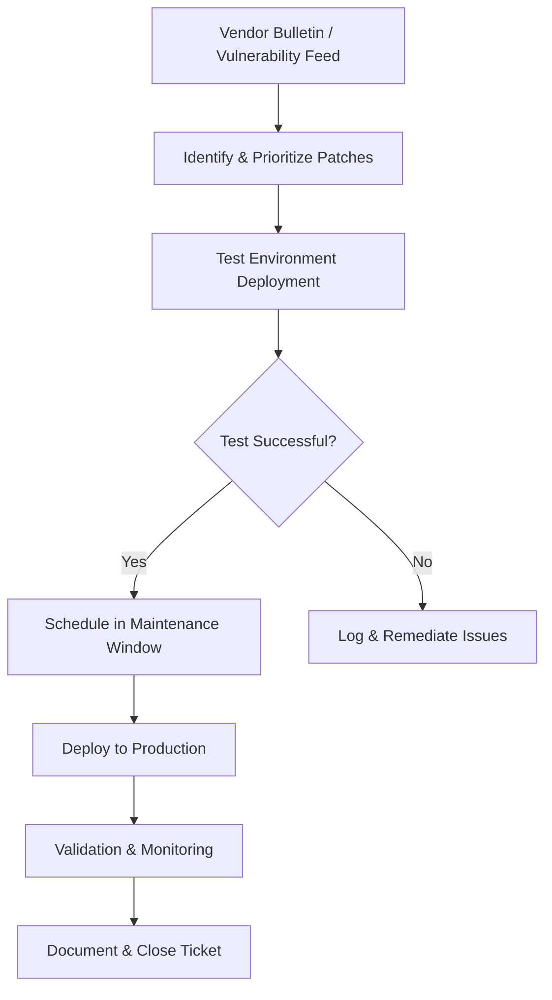

# Software Update & Patching Process

**Version:** 1.0  
**Effective Date:** [Date]  
**Last Reviewed:** [Date]

## 1. Purpose

To ensure timely, controlled, and consistent deployment of software updates and security patches across the IT environment, reducing vulnerabilities and maintaining compliance.

## 2. Scope

This process applies to operating systems, applications, firmware, and any software-managed components on organization-owned devices and servers.

## 3. Prerequisites

*   Inventory of systems and applications requiring updates.
*   Test environment matching production configuration.
*   Maintenance windows established for patch deployment.

## 4. Procedure Steps

1.  **Patch Identification:**  
    *   Subscribe to vendor security bulletins, vulnerability feeds, and internal asset inventory.
    *   Identify critical patches and updates.
2.  **Impact Assessment:**  
    *   Evaluate potential impact on systems, applications, and business processes.
    *   Prioritize patches based on severity (e.g., Critical, High, Medium, Low).
3.  **Testing:**  
    *   Apply patches in a test environment mirroring production.
    *   Validate functionality and compatibility.
4.  **Scheduling:**  
    *   Schedule deployment during maintenance windows.
    *   Communicate schedule and potential downtime to stakeholders.
5.  **Deployment:**  
    *   Deploy patches to production using automated tooling (e.g., SCCM, WSUS, Ansible).
6.  **Validation:**  
    *   Verify patch installation success and system health post-deployment.
    *   Monitor logs and alerts for anomalies.
7.  **Documentation:**  
    *   Document patch details, deployment status, and any issues in the ITSM ticket.
8.  **Exception Handling:**  
    *   If critical business impact is detected, rollback changes or implement workaround as per rollback plan.

## 5. Roles and Responsibilities

*   **Patch Coordinator:** Manages patch identification, planning, and scheduling.  
*   **Test Engineer:** Validates patches in test environments.  
*   **Systems Administrator:** Executes deployment and validation in production.  
*   **Change Manager:** Reviews and approves patch deployment as part of change management.

## 6. Workflow Diagram

