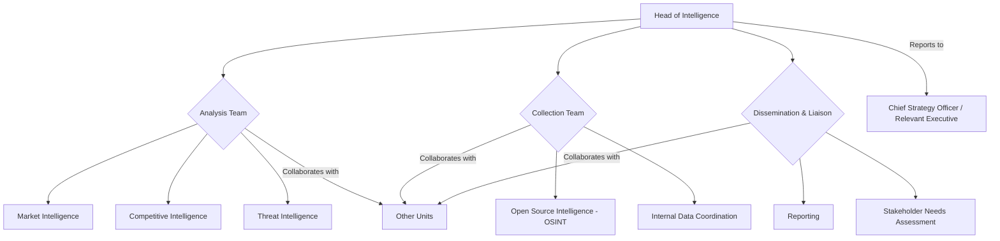

# Intelligence Unit Charter

## 1. Introduction & Purpose

The Intelligence Unit serves as the central hub for gathering, analyzing, processing, and disseminating relevant intelligence to support strategic and operational decision-making across the organization. Its primary purpose is to provide timely, accurate, and actionable insights regarding the competitive landscape, market trends, potential threats, and opportunities.

## 2. Mission Statement

To empower the organization with comprehensive intelligence, enabling proactive strategies, informed decisions, and sustained competitive advantage.

## 3. Scope & Authority

- **Scope:** The unit's scope encompasses competitive intelligence, market intelligence, geopolitical analysis, technological tracking, security threat intelligence, and internal operational intelligence relevant to strategic goals.
- **Authority:** The Intelligence Unit is authorized to:
    - Request information from other organizational units (subject to data governance policies).
    - Utilize approved tools and resources for data collection and analysis.
    - Disseminate intelligence reports to authorized stakeholders.
    - Collaborate with internal and external experts as needed.

## 4. Key Responsibilities

- **Intelligence Collection:** Systematically gather information from open sources, internal data, subscription services, and human intelligence networks (within ethical and legal boundaries).
- **Analysis & Production:** Analyze collected information to identify patterns, trends, insights, and potential impacts. Produce tailored intelligence products (briefs, reports, assessments).
- **Dissemination:** Distribute intelligence products to relevant stakeholders in a clear, concise, and timely manner through appropriate channels.
- **Threat Monitoring:** Continuously monitor the external environment for emerging threats and risks.
- **Opportunity Identification:** Identify potential strategic opportunities based on market dynamics and competitive positioning.
- **Stakeholder Engagement:** Liaise with key stakeholders to understand their intelligence needs and provide relevant support.
- **Process Improvement:** Continuously refine intelligence processes, tools, and methodologies.
- **Ethical & Legal Compliance:** Ensure all intelligence activities adhere to relevant laws, regulations, and ethical guidelines (See [[Policies/Ethical_Guidelines.md]]).

## 5. Organizational Structure & Reporting

*Note: Specific team structure may evolve based on organizational needs.*

## 6. Key Stakeholders

- Executive Leadership (CEO, CSO, COO, CTO, etc.)
- Strategy Unit
- Product Management
- Business Development / Sales
- Marketing
- Risk Management / Security
- Legal & Compliance
- Research & Development

## 7. Resources

- Dedicated personnel (Analysts, Collection Specialists)
- Budget for tools, subscriptions, and training
- Access to relevant internal data sources
- Collaboration platforms

## 8. Success Metrics

- Timeliness and accuracy of intelligence products.
- Relevance and actionability of insights provided.
- Stakeholder satisfaction scores.
- Contribution to key strategic decisions and outcomes.
- Identification of previously unknown threats or opportunities.

## 9. Review & Revision

This charter will be reviewed annually and updated as necessary to reflect changes in the organizational strategy, operating environment, or intelligence needs.

## 10. Approval

*Signatures/Approval Date*
