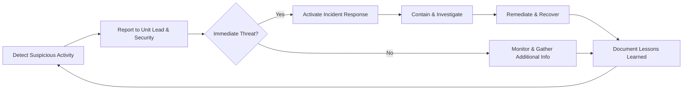

# Counterintelligence Awareness Policy

## 1. Purpose

To protect the Intelligence Unit and its operations from hostile intelligence activities, including espionage, elicitation, social engineering, insider threats, and data compromise. This policy defines threat vectors, protective measures, reporting procedures, and training requirements.

## 2. Scope

Applies to all Intelligence Unit personnel, contractors, and partners involved in intelligence-related activities. Covers processes and behavior to detect, deter, and respond to counterintelligence threats.

## 3. Threat Vectors

- **Elicitation:** Attempts to extract sensitive information through conversation (in-person, phone, email, social media).
- **Social Engineering:** Phishing, pretexting, baiting, tailgating, or other manipulative tactics.
- **Insider Threats:** Authorized personnel intentionally or inadvertently leaking or mishandling intelligence information.
- **Technical Intrusion:** Cyber attacks targeting intelligence systems (malware, spear-phishing, network intrusion).
- **Supply Chain Infiltration:** Compromise of third-party services or tools used by the Intelligence Unit.

## 4. Protective Measures

- **Need-to-Know Principle:** Restrict information access strictly to individuals whose roles require it.
- **Secure Communication:** Use encrypted channels for sensitive discussions and report transmissions per [[Data_Handling_Policy.md]].
- **Identity Verification:** Verify identities of unknown contacts before sharing any information.
- **Social Engineering Awareness:** Scrutinize unsolicited requests for information; validate via independent channels.
- **Physical Security:** Control access to workspaces; secure portable devices and printed materials.
- **System Security:** Keep software and systems up-to-date; use multi-factor authentication and strong passwords.
- **Supply Chain Vetting:** Assess security posture of third-party vendors and tools before approval.

## 5. Reporting & Incident Response

- **Reporting:** Immediately report suspected counterintelligence activities or anomalies to the unit lead and the corporate Security or Compliance team.
- **Incident Response:** Follow the organizational Incident Response Plan. Key steps include:
    1. **Containment:** Limit further exposure by isolating affected systems and communications.
    2. **Investigation:** Collaborate with Security/Risk teams to determine scope and root cause.
    3. **Remediation:** Apply patches, revoke access, update procedures, and reinforce training.
    4. **Notification:** Inform affected stakeholders and leadership per organizational policy.
    5. **Lessons Learned:** Document findings and update counterintelligence measures.

## 6. Training & Awareness

- **Initial Training:** All personnel must complete counterintelligence awareness training upon assignment.
- **Ongoing Refresher:** Annual refresher courses covering emerging threat vectors and case studies.
- **Simulations & Drills:** Participate in periodic social engineering and response drills.

## 7. Roles & Responsibilities

- **All Personnel:** Stay vigilant, follow protective measures, report anomalies.
- **Unit Lead:** Ensure policy dissemination, coordinate training, liaise with Security.
- **Security/Compliance Teams:** Provide support for investigations, threat intelligence, and incident response.

## 8. Policy Review

This policy will be reviewed annually or after any significant counterintelligence incident to incorporate lessons learned and update measures accordingly. 