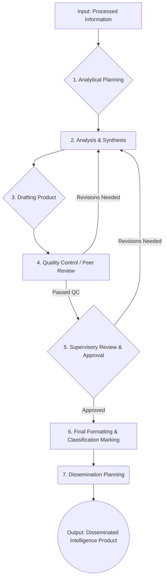

# Intelligence Production Process

## 1. Purpose

This document details the process for transforming processed information into finished intelligence products (reports, briefs, assessments, alerts). It elaborates on Phase 4 (Analysis & Production) and Phase 5 (Dissemination) of the [[Intelligence_Cycle.md]] and aligns with the [[../Policies/Reporting_Policy.md]].

## 2. Scope

This process covers activities from the receipt of processed information ready for analysis through to the final review, approval, and dissemination of intelligence products.

## 3. Process Flow

## 4. Step Descriptions

### 4.1. Analytical Planning
- **Objective:** Define the analytical approach and structure for the final product based on the intelligence requirement and processed information.
- **Activities:**
    - Review the original intelligence requirement (KIQs/PIRs).
    - Select appropriate analytical techniques (e.g., SWOT, PESTLE, competitor benchmarking, scenario analysis, structured analytic techniques - SATs).
    - Outline the structure of the final report/product (referencing [[../Reports/Report_Templates.md]]).
    - Identify key judgments or assessments to be developed.
    - Confirm deadlines and target audience.
- **Inputs:** Processed Information, Intelligence Requirement, Report Templates.
- **Outputs:** Analytical Plan, Report Outline.

### 4.2. Analysis & Synthesis
- **Objective:** Apply analytical techniques to interpret information, identify insights, and develop assessments.
- **Activities:**
    - Evaluate information for relevance, reliability, and credibility.
    - Apply chosen analytical techniques systematically.
    - Synthesize findings from multiple sources.
    - Identify patterns, trends, anomalies, and relationships.
    - Develop hypotheses and test them against evidence.
    - Assess implications, opportunities, and threats.
    - Formulate key judgments and estimate confidence levels.
    - Identify critical intelligence gaps.
- **Inputs:** Processed Information, Analytical Plan.
- **Outputs:** Analytical Findings, Key Judgments, Confidence Levels, Identified Gaps.

### 4.3. Drafting Product
- **Objective:** Create the initial draft of the intelligence product.
- **Activities:**
    - Write content based on the report outline and analytical findings.
    - Structure the report logically (e.g., BLUF, key judgments, supporting analysis, methodology, sources).
    - Use clear, concise language appropriate for the audience.
    - Incorporate necessary charts, graphs, or visuals.
    - Ensure proper attribution and sourcing where required.
    - Draft initial classification markings.
- **Inputs:** Report Outline, Analytical Findings, Report Templates.
- **Outputs:** Draft Intelligence Product.

### 4.4. Quality Control / Peer Review
- **Objective:** Review the draft product for analytical rigor, clarity, logic, and completeness.
- **Activities:**
    - Peer review by another analyst or team member.
    - Check for analytical soundness (e.g., assumptions stated, biases challenged, alternative explanations considered?).
    - Verify clarity, grammar, and adherence to formatting standards.
    - Confirm logical flow and support for key judgments.
    - Validate source descriptions and confidence levels.
    - Provide constructive feedback for revision.
- **Inputs:** Draft Intelligence Product, Review Checklist (if applicable).
- **Outputs:** Reviewed Draft with Feedback / QC Pass.

### 4.5. Supervisory Review & Approval
- **Objective:** Obtain final approval from authorized personnel (e.g., Team Lead, Head of Intelligence).
- **Activities:**
    - Review the QC'd draft for strategic alignment, policy compliance, and overall quality.
    - Verify the appropriateness of key judgments and recommendations.
    - Confirm final classification and handling instructions.
    - Provide final approval for dissemination or request further revisions.
- **Inputs:** QC'd Draft Intelligence Product.
- **Outputs:** Approved Intelligence Product / Revision Request.

### 4.6. Final Formatting & Classification Marking
- **Objective:** Prepare the approved product for dissemination.
- **Activities:**
    - Apply final formatting according to templates and style guides.
    - Ensure all required classification markings (overall and potentially portion marking) are correctly applied as per [[../Policies/Intelligence_Data_Classification_Guideline.md]].
    - Add required headers/footers, date, author, distribution list.
    - Convert to appropriate final format (e.g., PDF).
- **Inputs:** Approved Intelligence Product.
- **Outputs:** Finalized Intelligence Product.

### 4.7. Dissemination Planning
- **Objective:** Ensure the finalized product reaches the intended audience securely and effectively.
- **Activities:**
    - Confirm the authorized distribution list based on need-to-know and classification.
    - Select the appropriate secure dissemination channel (as per [[../Policies/Data_Handling_Policy.md]]).
    - Prepare any necessary cover notes or briefing materials.
    - Log the dissemination activity (report ID, recipients, date/time).
    - (Dissemination execution itself follows this planning step).
- **Inputs:** Finalized Intelligence Product, Distribution List, Reporting Policy.
- **Outputs:** Dissemination Log Entry, Transmitted Product.

## 5. Analytical Standards & Techniques

- Analysts are expected to employ rigorous analytical standards, including:
    - **Objectivity:** Strive for unbiased analysis.
    - **All-Source Analysis:** Utilize all available relevant information.
    - **Distinction:** Clearly differentiate between information and analysis/judgment.
    - **Accuracy:** Ensure factual correctness.
    - **Relevance:** Tailor analysis to the requirement.
    - **Clarity:** Communicate findings unambiguously.
    - **Timeliness:** Deliver analysis when needed.
- Reference [Link to internal/external resource on Structured Analytic Techniques, if applicable] for specific methodologies.

## 6. Review & Improvement

This process will be reviewed regularly, incorporating feedback from analysts and intelligence consumers to identify areas for enhancement. 