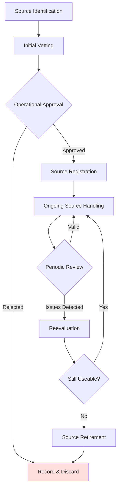

# Source Management Process

## 1. Purpose

This document outlines the process for identifying, vetting, managing, evaluating, and retiring intelligence sources (human, technical, and documentary) to ensure the reliability and ethical handling of source information.

## 2. Scope

Applies to all sources used during intelligence collection activities as defined in the [[Intelligence_Cycle.md]] and subject to the [[Data_Handling_Policy.md]] and [[Ethical_Guidelines.md]].

## 3. Source Types

- **Human Intelligence (HUMINT):** Individuals who provide information voluntarily or involuntarily (e.g., subject-matter experts, informants).
- **Open Source Intelligence (OSINT):** Publicly available documents, publications, social media, forums.
- **Technical / SIGINT:** Data derived from technical means (e.g., network sensors, signal intercepts, proprietary databases).
- **Documentary / LEGINT:** Official documents, filings, databases (e.g., regulatory filings, patent offices).

## 4. Process Flow

## 5. Step Descriptions

### 5.1. Source Identification
- **Objective:** Identify potential sources relevant to intelligence requirements.
- **Activities:**
    - Map intelligence gaps to potential source categories.
    - Solicit recommendations from stakeholders or subject-matter experts.
    - Monitor signals for potential new technical or documentary sources.
- **Outputs:** Candidate Source List.

### 5.2. Initial Vetting
- **Objective:** Assess candidate sources for reliability, credibility, and ethical/legal acceptability.
- **Activities:**
    - Verify identity or authenticity.
    - Check background and track record (for HUMINT).
    - Assess quality of information historically produced.
    - Ensure compliance with Ethical Guidelines and legal requirements.
    - Document source characteristics (reliability rating if possible).
- **Outputs:** Vetting Report.

### 5.3. Operational Approval
- **Objective:** Obtain authorization to engage with the source operationally.
- **Activities:**
    - Present vetting findings to Unit Lead or designated approval authority.
    - Highlight any ethical, legal, or security concerns.
    - Secure approval decision and conditions of handling.
- **Outputs:** Approval or Rejection Record.

### 5.4. Source Registration
- **Objective:** Record source details in the Intelligence Source Registry.
- **Activities:**
    - Assign unique Source ID.
    - Record classification level for source information (see [[../Policies/Intelligence_Data_Classification_Guideline.md]]).
    - Log source reliability rating and reporting guidelines.
    - Capture contact and handling instructions.
- **Outputs:** Source Registry Entry.

### 5.5. Ongoing Source Handling
- **Objective:** Manage source relationships and data flow throughout the collection process.
- **Activities:**
    - Maintain regular communication as per established protocols.
    - Monitor for changes in source reliability or handling risks.
    - Update metadata (frequency, quality, relevance of contributions).
    - Protect source information confidentiality.
- **Outputs:** Updated Source Records, Collection Logs.

### 5.6. Periodic Review
- **Objective:** Ensure sources remain reliable, secure, and compliant.
- **Activities:**
    - Schedule reviews (e.g., quarterly) of active sources.
    - Re-evaluate reliability ratings and ethical considerations.
    - Identify any emerging risks or issues (e.g., compromised HUMINT source).
- **Outputs:** Review Reports.

### 5.7. Reevaluation & Retirement
- **Objective:** Determine whether to continue using, adjust, or retire the source.
- **Activities:**
    - Based on review findings, request continued use or retirement.
    - If retiring, ensure secure disposition of source-related materials and update registry.
- **Outputs:** Retirement Record, Updated Registry.

## 6. Roles & Responsibilities

- **Analysts/Collection Officers:** Conduct identification, vetting, and ongoing handling.
- **Unit Lead:** Approve source engagement and oversee registry.
- **Security/Compliance:** Support vetting and handle legal/ethical issues.

## 7. Source Registry Maintenance

- Keep the Source Registry in a secure system with access controls.
- Audit registry entries periodically for accuracy and completeness.

## 8. Integration with Processes

- Ensure alignment with the intelligence cycle phases and reporting processes.
- Use source metadata to inform analysis, confidence ratings, and product classifications.

## 9. Document Review

Review this process annually or after any significant source-related incident. 