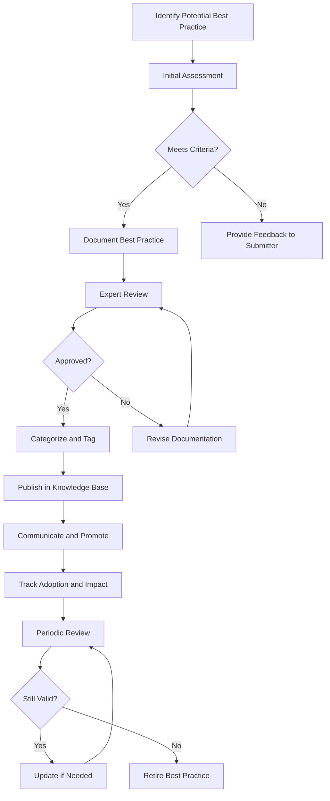

# Best Practice Identification Process

## Overview

This document outlines the process for identifying, documenting, validating, and sharing best practices across the organization. A best practice is a technique, method, process, or activity that is believed to be more effective at delivering a particular outcome than any other approach when applied to a specific condition or circumstance.

## Related Policies

- [[../Policies/KnowledgeSharingPolicy|Knowledge Sharing Policy]]
- [[../Policies/KnowledgeCreationPolicy|Knowledge Creation Policy]]

## Process Owner

- [[../PositionsPersonas|Knowledge Management Unit]]

## Process Stakeholders

- All organizational units
- Subject Matter Experts (SMEs)
- [[../../ExecutiveCommittee/index|Executive Committee]] (for strategic best practices)
- [[../../QualityAssurance/index|Quality Assurance Unit]]

## Process Diagram

## Detailed Process Steps

### 1. Identify Potential Best Practice

**Description:** Identification of potential best practices from various sources within the organization.

**Activities:**
- Monitor performance metrics to identify exceptional results
- Review [[../../Research/MeetingNotes/|research findings]] and innovation projects
- Analyze successful project outcomes and techniques
- Consider employee suggestions submitted through the [[../../Innovation/Processes/IdeaSubmissionProcess|idea submission process]]
- Examine customer feedback and success stories

**Inputs:**
- Performance data
- Project postmortems and [[../Processes/LessonsLearnedProcess|lessons learned]]
- Employee suggestions
- Customer feedback
- Audit results

**Outputs:**
- Potential best practice candidates

**Tools/Systems:**
- Performance monitoring dashboards
- Suggestion systems
- [[../../CustomerSupport/index|Customer feedback systems]]

### 2. Initial Assessment

**Description:** Preliminary evaluation of the potential best practice against established criteria.

**Activities:**
- Assess alignment with organizational goals
- Verify repeatability and scalability
- Evaluate potential value and impact
- Check for existing similar practices

**Criteria:**
- Demonstrates measurable improvement over standard approaches
- Aligns with organizational values and objectives
- Can be adopted by others with reasonable effort
- Has been successfully applied multiple times
- Is based on sound principles and reasoning

**Outputs:**
- Assessment report
- Decision to proceed or decline

### 3. Document Best Practice

**Description:** Comprehensive documentation of the approved best practice.

**Activities:**
- Interview practitioners and subject matter experts
- Document context, methodology, and implementation steps
- Identify critical success factors and potential pitfalls
- Document measurable outcomes and benefits
- Specify resources required for implementation

**Documentation Components:**
- Title and unique identifier
- Problem/opportunity addressed
- Context and applicability
- Step-by-step implementation guide
- Resources and tools required
- Expected outcomes and metrics
- Case examples
- Contact information for experts

**Outputs:**
- Draft best practice documentation

**Templates:**
- [[../../templates/documentation/BestPracticeTemplate|Best Practice Documentation Template]]

### 4. Expert Review

**Description:** Validation of the best practice by subject matter experts and practitioners.

**Activities:**
- Identify appropriate reviewers based on domain expertise
- Conduct peer review sessions
- Validate accuracy, completeness, and practicality
- Gather improvement suggestions

**Outputs:**
- Review feedback
- Approval or revision requests

### 5. Categorize and Tag

**Description:** Properly categorizing and tagging the best practice for optimal searchability.

**Activities:**
- Apply appropriate taxonomy categories
- Add metadata tags for searchability
- Link to related knowledge assets
- Assign appropriate access permissions

**Outputs:**
- Fully tagged and categorized best practice document

**Reference:**
- [[../Policies/DataClassificationPolicy|Data Classification Policy]]

### 6. Publish in Knowledge Base

**Description:** Making the validated best practice available in the organizational knowledge base.

**Activities:**
- Upload to the appropriate repository
- Create necessary cross-references and links
- Perform quality checks on formatting and accessibility

**Outputs:**
- Published best practice in knowledge base

### 7. Communicate and Promote

**Description:** Increasing awareness and adoption of the best practice.

**Activities:**
- Develop communication plan for target audience
- Create awareness through newsletters, team meetings, and [[../../TrainingDevelopment/index|training sessions]]
- Identify and engage champions in relevant departments
- Consider incentives for adoption

**Outputs:**
- Communication materials
- Awareness sessions
- Training modules

### 8. Track Adoption and Impact

**Description:** Monitoring the implementation and impact of the best practice.

**Activities:**
- Establish metrics to track adoption rates
- Measure impact on key performance indicators
- Gather user feedback and implementation experiences
- Document challenges and variations in implementation

**Outputs:**
- Adoption metrics
- Impact assessment reports
- User feedback summary

### 9. Periodic Review

**Description:** Regular review to ensure the best practice remains relevant and effective.

**Activities:**
- Schedule reviews at appropriate intervals (typically 6-12 months)
- Reassess against current organizational context
- Evaluate continued relevance and effectiveness
- Identify potential improvements or updates

**Outputs:**
- Review results
- Decision to maintain, update, or retire

## Roles and Responsibilities

| Role | Responsibilities |
|------|------------------|
| Process Owner (KM Unit) | Oversee the entire process, maintain standards, provide tools and templates |
| Submitters | Identify and propose potential best practices |
| Subject Matter Experts | Review, validate, and provide domain expertise |
| Knowledge Managers | Facilitate documentation, categorization, and publishing |
| Unit Leaders | Encourage adoption within their units, provide feedback |
| Practice Champions | Promote and support implementation within their domains |

## Performance Metrics

- Number of best practices identified and documented per quarter
- Time from identification to publication
- Adoption rate across applicable units
- Measured impact of implemented best practices
- User satisfaction with best practice documentation

## Related Processes

- [[LessonsLearnedProcess|Lessons Learned Process]]
- [[KnowledgeReviewProcess|Knowledge Review and Validation Process]]
- [[../../Research/Processes/ResearchDisseminationProcess|Research Dissemination Process]]
- [[../../QualityAssurance/Processes/ContinuousImprovementProcess|Continuous Improvement Process]]

## References

- [[../Charter|Knowledge Management Unit Charter]]
- [[../Policies/KnowledgeCreationPolicy|Knowledge Creation Policy]]
- [[../../templates/documentation/BestPracticeTemplate|Best Practice Documentation Template]] 