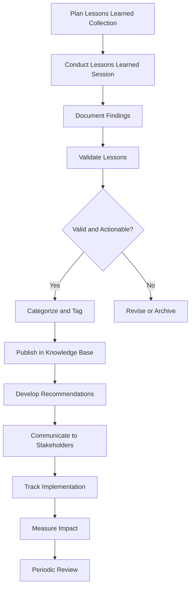

# Lessons Learned Process

## Overview

This document outlines the systematic process for capturing, documenting, validating, sharing, and implementing lessons learned from projects, initiatives, and operational activities across the organization. The lessons learned process is a critical component of our organizational learning and continuous improvement efforts.

## Related Policies

- [[../Policies/KnowledgeSharingPolicy|Knowledge Sharing Policy]]
- [[../Policies/KnowledgeCreationPolicy|Knowledge Creation Policy]]
- [[../Policies/KnowledgeRetentionPolicy|Knowledge Retention Policy]]

## Process Owner

- [[../PositionsPersonas|Knowledge Management Unit]]

## Process Stakeholders

- Project/Initiative Managers
- Team Members and Participants
- Department/Unit Leaders
- [[../../ProductManagement/index|Product Management Unit]]
- [[../../QualityAssurance/index|Quality Assurance Unit]]
- [[../../Research/index|Research Unit]]
- [[../../RiskManagement/index|Risk Management Unit]]

## Process Diagram

## Detailed Process Steps

### 1. Plan Lessons Learned Collection

**Description:** Preparation and planning for the lessons learned collection activities.

**Activities:**
- Determine timing and frequency (e.g., project milestones, post-implementation)
- Identify appropriate participants and stakeholders
- Select appropriate collection methods
- Prepare necessary materials and templates
- Schedule and communicate sessions

**Timing Considerations:**
- Major project/phase completion
- After significant milestones
- At regular intervals for ongoing operations
- After incidents or exceptional events
- Annual departmental reviews

**Outputs:**
- Lessons learned collection plan
- Session schedule
- Participant list

**Templates:**
- [[../../templates/project/LessonsLearnedSessionAgenda|Lessons Learned Session Agenda Template]]
- [[../../templates/project/LessonsLearnedPlanningChecklist|Lessons Learned Planning Checklist]]

### 2. Conduct Lessons Learned Session

**Description:** Facilitated sessions to elicit and capture lessons learned from participants.

**Activities:**
- Set ground rules emphasizing psychological safety and no-blame approach
- Review objectives and process with participants
- Facilitate structured discussion using appropriate techniques
- Document all inputs
- Prioritize findings collaboratively
- Identify potential actions and recommendations

**Facilitation Techniques:**
- After Action Review (AAR)
- Retrospectives
- Plus/Delta exercises
- Root cause analysis
- Timeline analysis
- Focus groups
- Surveys and questionnaires

**Outputs:**
- Raw session notes
- Prioritized list of observations and insights
- Initial action recommendations

**Guidance:**
- [[../../TrainingDevelopment/Processes/FacilitationGuidelines|Facilitation Guidelines]]
- [[../../templates/project/LessonsLearnedFacilitationGuide|Lessons Learned Facilitation Guide]]

### 3. Document Findings

**Description:** Formal documentation of the lessons learned findings in a structured format.

**Activities:**
- Analyze and synthesize raw session data
- Identify key themes and patterns
- Document each lesson using the standard template
- Link to relevant evidence, data, or examples
- Identify potential categorization and tagging

**Documentation Elements:**
- Unique identifier for each lesson
- Context (project, initiative, operation)
- What was expected to happen
- What actually happened
- Root causes or contributing factors
- Impact (positive or negative)
- Recommendations for future actions
- Supporting evidence and examples

**Outputs:**
- Draft lessons learned documents

**Templates:**
- [[../../templates/documentation/LessonLearnedTemplate|Lesson Learned Documentation Template]]

### 4. Validate Lessons

**Description:** Review and validation of documented lessons to ensure accuracy, relevance, and actionability.

**Activities:**
- Review by session participants for accuracy
- Validation by subject matter experts
- Assessment by relevant department/unit leaders
- Evaluate against validation criteria

**Validation Criteria:**
- Factual accuracy and clarity
- Relevance to organizational objectives
- Actionability and practical application
- Potential value and impact
- Generalizability to other contexts

**Outputs:**
- Validated lessons
- Validation feedback
- Decision to publish, revise, or archive

### 5. Categorize and Tag

**Description:** Organizing lessons learned for optimal searchability and application.

**Activities:**
- Apply appropriate taxonomy categories
- Add metadata tags based on standard taxonomy
- Identify cross-functional applications
- Link to related knowledge assets
- Assign appropriate access permissions

**Categorization Dimensions:**
- Business area/department
- Project/process type
- Issue type (technical, management, communication, etc.)
- Impact level
- Application scope
- Root cause category

**Outputs:**
- Fully categorized and tagged lessons learned

**Reference:**
- [[../Policies/DataClassificationPolicy|Data Classification Policy]]
- [[../../KnowledgeManagement/Processes/KnowledgeCaptureProcess|Knowledge Capture Process]]

### 6. Publish in Knowledge Base

**Description:** Making validated lessons learned available in the organizational knowledge base.

**Activities:**
- Upload to the appropriate repository
- Create necessary cross-references
- Perform quality checks on formatting and accessibility
- Add to relevant collections or views

**Outputs:**
- Published lessons learned in knowledge base

**Systems:**
- Organizational knowledge base
- Project management system
- [[../../InformationTechnology/index|IT systems and repositories]]

### 7. Develop Recommendations

**Description:** Transforming lessons learned into actionable recommendations.

**Activities:**
- Analyze patterns across multiple lessons
- Identify systemic issues and improvement opportunities
- Develop specific, actionable recommendations
- Link recommendations to organizational objectives
- Identify responsible parties for implementation

**Recommendation Types:**
- Process changes
- Policy updates
- Training needs
- Tool/system improvements
- Resource allocation adjustments
- Risk mitigation measures

**Outputs:**
- Actionable recommendations
- Implementation suggestions

### 8. Communicate to Stakeholders

**Description:** Sharing lessons learned and recommendations with relevant stakeholders.

**Activities:**
- Identify target audiences for each lesson/recommendation
- Develop appropriate communication materials
- Present findings in relevant forums
- Incorporate into onboarding and training programs
- Provide context on how to apply the lessons

**Communication Channels:**
- Department/team meetings
- Project kickoff sessions
- Executive briefings
- Training sessions
- Newsletters and internal communications
- [[../../OrganizationalDevelopment/index|Communities of practice]]

**Outputs:**
- Communication materials
- Presentations and briefings
- Training content updates

### 9. Track Implementation

**Description:** Monitoring the implementation of recommendations derived from lessons learned.

**Activities:**
- Assign responsibility for implementation tracking
- Establish implementation plan with milestones
- Monitor progress against plan
- Document implementation challenges
- Report on implementation status

**Outputs:**
- Implementation tracking dashboard
- Status reports
- Implementation case studies

### 10. Measure Impact

**Description:** Evaluating the impact of implemented lessons learned on organizational performance.

**Activities:**
- Establish metrics to measure impact
- Collect baseline and post-implementation data
- Analyze results and calculate ROI where applicable
- Document success stories and challenges
- Identify factors affecting successful application

**Metrics Examples:**
- Error/defect reduction
- Cost savings
- Time savings
- Risk reduction
- Quality improvements
- Customer satisfaction impact

**Outputs:**
- Impact assessment reports
- Success case studies
- ROI calculations

### 11. Periodic Review

**Description:** Regular review of the lessons learned repository for relevance, accuracy, and utilization.

**Activities:**
- Establish review schedule (typically annual)
- Assess usage patterns and application rates
- Review continued relevance of older lessons
- Update, archive, or retire lessons as appropriate
- Identify knowledge gaps and collection priorities

**Outputs:**
- Repository maintenance actions
- Updated lessons
- Archived lessons
- Collection priorities

## Roles and Responsibilities

| Role | Responsibilities |
|------|------------------|
| Process Owner (KM Unit) | Oversee the process, provide methodologies and tools, maintain knowledge base |
| Facilitators | Plan and conduct lessons learned sessions, document initial findings |
| Project/Initiative Managers | Ensure lessons learned activities are included in project plans, support implementation |
| Subject Matter Experts | Validate technical aspects of lessons learned, contribute to recommendations |
| Department/Unit Leaders | Support application of relevant lessons, allocate resources for implementation |
| Knowledge Managers | Facilitate documentation, categorization, and publishing |
| Implementation Owners | Execute recommended actions, report on progress and challenges |

## Performance Metrics

- Number of lessons learned sessions conducted
- Number of lessons documented and validated
- Time from session to publication
- Number of recommendations implemented
- Measured impact of implemented recommendations
- Usage statistics for lessons learned repository
- Cross-functional application rates

## Related Processes

- [[BestPracticeIdentificationProcess|Best Practice Identification Process]]
- [[KnowledgeReviewProcess|Knowledge Review and Validation Process]]
- [[../../ProductManagement/Processes/ProductDevelopmentProcess|Product Development Process]]
- [[../../QualityAssurance/Processes/ContinuousImprovementProcess|Continuous Improvement Process]]
- [[../../RiskManagement/Processes/RiskMitigationProcess|Risk Mitigation Process]]

## References

- [[../Charter|Knowledge Management Unit Charter]]
- [[../Policies/KnowledgeSharingPolicy|Knowledge Sharing Policy]]
- [[../../templates/documentation/LessonLearnedTemplate|Lesson Learned Documentation Template]]
- [[../../templates/project/LessonsLearnedSessionAgenda|Lessons Learned Session Agenda Template]] 