# Legal Unit Organizational Chart

```mermaid
graph TD
    subgraph LegalUnit [Legal Unit]
        direction TB
        HeadLegal(Head of Legal / General Counsel)
        
        subgraph ContractsMgmt [Contracts Management]
            direction TB
            ContractManager(Contract Manager/Counsel)
            ContractAdmin(Contract Administrator)
        end

        subgraph IP [Intellectual Property]
            direction TB
            IPCounsel(IP Counsel)
            IPParalegal(IP Paralegal)
        end

        subgraph LitigationDisputes [Litigation & Disputes]
            direction TB
            LitigationCounsel(Litigation Counsel)
            LitigationParalegal(Litigation Paralegal)
        end
        
        subgraph ComplianceRegulatory [Compliance & Regulatory]
            direction TB
            ComplianceOfficer(Compliance Officer/Counsel)
            ComplianceSpecialist(Compliance Specialist)
        end

        subgraph CorporateGovernance [Corporate Governance]
            direction TB
            CorpCounsel(Corporate Counsel)
            CorpParalegal(Corporate Paralegal)
        end

        subgraph LegalOps [Legal Operations]
            direction TB
            LegalOpsManager(Legal Operations Manager)
            LegalTechAdmin(Legal Tech Administrator)
        end

        HeadLegal --> ContractsMgmt;
        HeadLegal --> IP;
        HeadLegal --> LitigationDisputes;
        HeadLegal --> ComplianceRegulatory;
        HeadLegal --> CorporateGovernance;
        HeadLegal --> LegalOps;

    end

    style HeadLegal fill:#ccf,stroke:#333,stroke-width:2px
```

**Description:**

This chart outlines a possible structure for the Legal Unit, headed by the General Counsel. It includes specialized teams for Contracts, Intellectual Property, Litigation, Compliance, Corporate Governance, and Legal Operations. The actual structure may vary based on organizational size and needs. 