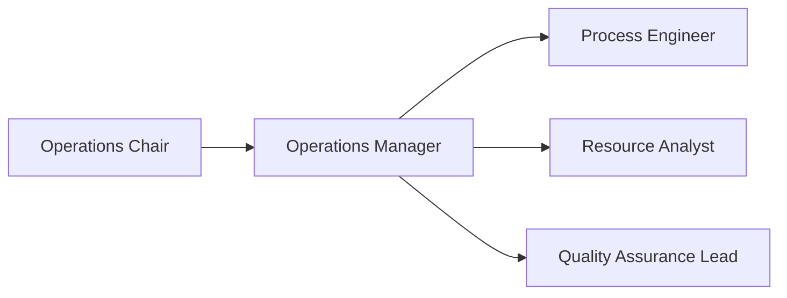
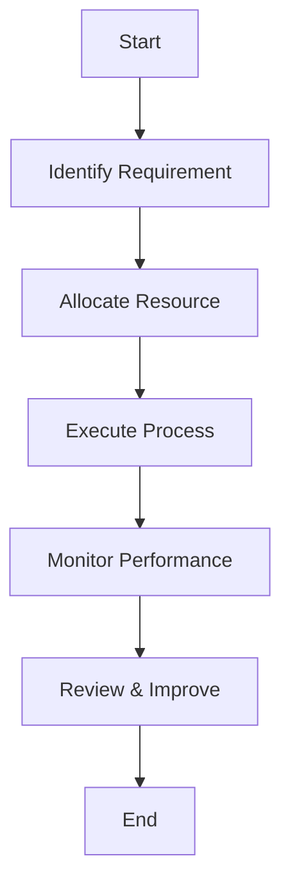

# Operations Unit Charter

## 📋 Charter Overview
### Purpose
The Operations Unit is responsible for ensuring efficient and effective delivery of operational services across the organization, driving process optimization, resource management, and continuous improvement.

### Scope
- Areas of responsibility: Operational processes, resource allocation, quality control, service delivery.
- Jurisdictional boundaries: Organization-wide, cross-functional with all business units.
- Operational domains: Process management, supply chain, service operations.
- Geographic coverage: Global operations.

## 🎯 Objectives and Goals
### Primary Objectives
1. Optimize end-to-end operational processes to enhance efficiency.
2. Manage resources effectively to meet service delivery targets.
3. Ensure consistent quality control and compliance across operations.

### Strategic Goals
1. Reduce process cycle time by 20% within 12 months.
2. Achieve a 95% on-time service delivery rate.
3. Implement a continuous improvement program with monthly Kaizen events.

## 👥 Membership and Structure
### Composition
- Leadership roles: Operations Director, Operations Manager.
- Core members: Process Engineer, Resource Analyst, Quality Assurance Lead.
- Advisory members: Finance Representative, IT Systems Architect.
- Support staff: Administrative Coordinator.

### Roles and Responsibilities
#### Chair/Leader
- Appointment process: Appointed by COO.
- Term duration: 2-year term, renewable.
- Key responsibilities: Provide strategic direction, approve policies, oversee unit performance.
- Authority limits: Budget approval up to $100K, process change sign-off.

#### Members
- Selection criteria: Demonstrated expertise in operations, process improvement certification.
- Term limits: 1-year term, rotating membership based on tenure.
- Core duties: Execute operational tasks, support projects, report performance metrics.
- Expected contributions: Propose improvements, deliver on KPIs.

#### Support Roles
- Administrative support: Meeting scheduling, document management.
- Technical advisors: Provide system integration guidance.
- Subject matter experts: Offer specialized knowledge on process domains.
- External consultants: Engage for specialized process optimization initiatives.

## 🔧 Governance Structure
### Decision Making
- Voting procedures: Simple majority of sitting members.
- Quorum requirements: Minimum 50% + 1 member.
- Decision thresholds: >2/3 majority for strategic changes.
- Veto powers: Chair has veto rights on non-budgetary decisions.

### Meeting Structure
- Frequency: Bi-weekly operational sync.
- Format: Hybrid (in-person and virtual).
- Required attendance: All core members.
- Documentation requirements: Minutes and action items recorded and published within two business days.

### Reporting Lines
- Hierarchical structure: Chair → Members → Support Roles.
- Communication channels: Slack (#operations), email distribution list.
- Escalation paths: Escalate issues to COO.
- Accountability framework: Monthly performance reports to Executive Committee.

## 📊 Operations Process Flow

## 📊 Operations
### Regular Activities
- Scheduled meetings: Bi-weekly operational sync.
- Review cycles: Monthly performance review.
- Reporting requirements: Weekly dashboards, monthly reports.
- Standard procedures: Process review, risk assessment.

### Special Activities
- Special sessions: Quarterly strategy workshops.
- Emergency procedures: Business continuity drills.
- Ad-hoc committees: Process improvement task force.
- Task forces: Cost optimization and quality audit teams.

### Working Groups
- Formation process: Proposal submitted to Chair.
- Scope definition: Detailed in group charter.
- Leadership selection: Appointed by Chair.
- Reporting requirements: Weekly updates to main unit.

## 🎯 Authority and Responsibilities
### Authority Levels
- Decision-making powers: Establish operational policies and procedures.
- Resource allocation: Approve day-to-day resource assignments.
- Policy setting: Propose and implement operational policies.
- Enforcement capabilities: Enforce compliance within the unit.

### Key Responsibilities
- Strategic planning: Develop operational roadmaps.
- Policy development: Draft and maintain standard procedures.
- Oversight functions: Monitor adherence to processes.
- Risk management: Identify and mitigate operational risks.

### Limitations
- Scope restrictions: Capital investments >$100K require Executive approval.
- Authority boundaries: Cannot override corporate policies.
- Resource constraints: Subject to annual budget allocations.
- Compliance requirements: Must adhere to corporate governance frameworks.

## 📈 Performance and Accountability
### Success Metrics
- Performance indicators: Cycle time, service levels, cost per unit.
- Quality measures: Defect rate, compliance incidents.
- Impact assessment: ROI on improvement projects.
- Effectiveness evaluation: Quarterly performance scorecards.

### Review Process
- Performance reviews: Monthly and quarterly.
- Charter updates: Annual review by the unit.
- Member evaluations: 360-degree feedback.
- Effectiveness assessment: Annual operational audit.

### Accountability Measures
- Reporting requirements: Weekly dashboards, monthly reports.
- Audit procedures: Internal audits bi-annually.
- Compliance monitoring: Continuous monitoring with quarterly review.
- Corrective actions: Formal improvement tickets.

## 🤝 Stakeholder Engagement
### Internal Stakeholders
- Communication methods: Weekly updates, dashboards.
- Engagement frequency: Weekly and monthly.
- Feedback mechanisms: Surveys and retrospectives.
- Collaboration frameworks: Cross-functional teams.

### External Stakeholders
- Relationship management: Quarterly vendor reviews.
- Communication channels: Email and vendor portals.
- Engagement protocols: SLA review meetings.
- Partnership agreements: Formal contracts.

## 📝 Documentation and Reporting
### Required Documentation
- Meeting minutes: Stored in documentation repository.
- Decision records: Documented in Confluence.
- Action items: Tracked in Jira.
- Progress reports: Distributed monthly.

### Reporting Requirements
- Report types: Weekly dashboard, monthly operations report.
- Frequency: Weekly and monthly.
- Distribution: Executive Committee and stakeholders.
- Review process: Peer review before distribution.

## 🔒 Compliance and Ethics
### Regulatory Compliance
- Applicable regulations: OSHA, ISO 9001, GDPR.
- Compliance requirements: Quarterly audits.
- Monitoring procedures: Continuous monitoring.
- Reporting obligations: Annual compliance report.

### Ethical Standards
- Code of conduct: Follow corporate ethics policy.
- Conflict of interest: Declare potential conflicts.
- Confidentiality: Protect sensitive data.
- Professional standards: Adhere to industry best practices.

## 🔄 Amendment Process
### Charter Updates
- Review frequency: Annual.
- Update procedures: Propose change and review.
- Approval process: Vote by unit members.
- Implementation timeline: Published within one month.

### Version Control
- Document history: Maintained in git.
- Change tracking: Via pull requests.
- Approval records: Stored in audit logs.
- Distribution updates: Notified via email.

## 📊 Resource Management
### Financial Resources
- Budget allocation: Annual budget planning.
- Expense management: Monthly budget reviews.
- Financial reporting: Monthly financial statements.
- Audit requirements: Annual finance audit.

### Human Resources
- Staffing needs: Assessed quarterly.
- Training requirements: Defined in training plan.
- Performance management: Annual reviews.
- Succession planning: Documented in HR records.

## 📝 Notes and References
### Supporting Documents
- Related policies: [[Operations Policies]].
- Procedures: [[Operations Processes]].
- Guidelines: [[Operations Guidelines]].
- Standards: [[Operations Standards]].

### Historical Context
- Formation history: Established in 2010 to centralize operations.
- Major milestones: ISO certification in 2015, ERP implementation in 2018.
