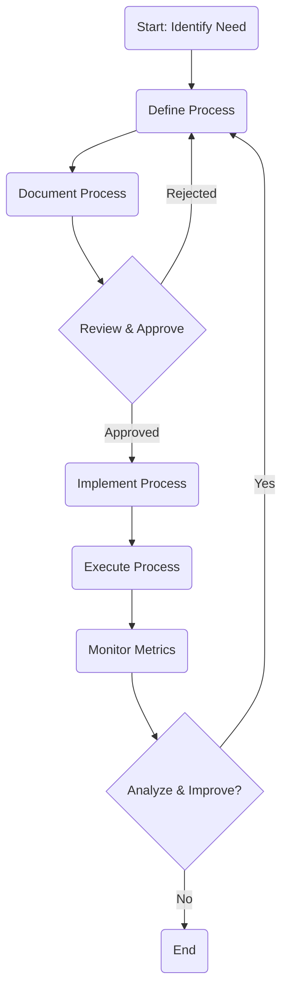

# Process Management - Operations Unit

## Process Overview
**Type**: Core
**Owner**: [[Operations Director]]
**Version**: 1.0
**Status**: Active

## Purpose and Scope
### Purpose
To define, document, execute, monitor, and improve operational processes across the organization.

### Scope
- **In Scope**: All core operational processes (e.g., service delivery, supply chain, quality control).
- **Out of Scope**: Non-operational processes (e.g., HR onboarding, sales cycles).

## Process Details
### Prerequisites
1. Approved Process Charter
2. Allocated Resources

### Inputs
1. Process Definition Document
   - Source: Process Engineer
   - Format: Standard template
   - Validation: Manager approval

2. Performance Data
   - Source: Monitoring Systems
   - Format: CSV/Dashboard API
   - Validation: Data integrity checks

### Process Steps

1. Step 1: Define Process
   - Action: Map current state, identify improvements, define future state.
   - Actor: Process Engineer
   - Tools: Visio, Process Mapping Software
   - Output: Process Definition Document

2. Step 2: Document Process
   - Action: Create Standard Operating Procedures (SOPs).
   - Actor: Process Engineer
   - Tools: Confluence, Word
   - Output: SOP Document

3. Step 3: Implement Process
   - Action: Train staff, update systems, deploy changes.
   - Actor: Operations Manager
   - Tools: Training materials, IT support
   - Output: Implemented Process

4. Step 4: Monitor & Improve
   - Action: Track KPIs, analyze performance, identify bottlenecks.
   - Actor: Resource Analyst, Process Engineer
   - Tools: Dashboard, Analytics tools
   - Output: Improvement Recommendations

### Outputs
1. Optimized Operational Process
   - Type: Workflow
   - Format: Deployed in relevant systems
   - Destination: Operational Teams
   - Usage: Daily execution

2. Performance Report
   - Type: Document
   - Format: PDF/Dashboard
   - Destination: Operations Director, Stakeholders
   - Usage: Performance review

## Roles and Responsibilities
### Process Roles
1. Operations Director
   - Responsibilities: Owns overall process, approves major changes.
   - Authority: Final approval authority.
   - Skills Required: Strategic thinking, leadership.

2. Process Engineer
   - Responsibilities: Design, document, and optimize processes.
   - Authority: Recommend changes.
   - Skills Required: Process mapping, Lean/Six Sigma.

## Controls and Metrics
### Process Controls
1. Change Approval Workflow
   - Type: Preventive
   - Implementation: Workflow tool
   - Monitoring: Audit logs

2. Performance Monitoring
   - Type: Detective
   - Implementation: Dashboards
   - Monitoring: Automated alerts

### Performance Metrics
1. Cycle Time
   - Description: Time from start to end of process.
   - Target: Reduce by 15% annually.
   - Measurement: System logs.
   - Frequency: Monthly

2. Defect Rate
   - Description: Percentage of outputs with errors.
   - Target: <1%.
   - Measurement: QA checks.
   - Frequency: Weekly

## Systems and Tools
### Required Systems
- [[Process Management Platform]] - Workflow automation
- [[Analytics System]] - Performance tracking

### Supporting Tools
- [[Visio]] / [[Lucidchart]] - Process mapping
- [[Confluence]] - Documentation

## Exceptions and Error Handling
### Common Exceptions
1. System Outage
   - Cause: IT Infrastructure issue.
   - Impact: Process delay.
   - Resolution: Follow IT incident response plan.

2. Data Input Error
   - Cause: Manual entry mistake.
   - Impact: Incorrect output.
   - Resolution: Data validation checks, user retraining.

## Related Processes
### Upstream Processes
- [[Strategic Planning]] - Provides operational goals

### Downstream Processes
- [[Service Delivery]] - Consumes optimized processes

## Documentation and Training
### Related Documentation
- [[Process Charter Template]]
- [[SOP Template]]

### Training Requirements
1. Process Execution Training
   - Audience: Operational Staff
   - Content: New SOPs and system usage.
   - Frequency: On implementation, annually thereafter.

## Compliance and Audit
### Compliance Requirements
1. ISO 9001 Clause 4.4
   - Source: External
   - Implementation: Documented processes, QMS.
   - Verification: Internal/External audits.

### Audit Points
1. Process Documentation Accuracy
   - What to Check: SOPs match actual execution.
   - How to Verify: Observation, interviews.
   - Evidence Required: Signed-off SOPs.

## Change Management
### Version History
| Version | Date       | Changes         | Author            |
|---------|------------|-----------------|-------------------|
| 1.0     | YYYY-MM-DD | Initial version | Operations Director |

### Change Process
1. Request Process
   - Submit change request form via Jira.
   - Reviewed by Process Engineer.
   - Approved by Operations Manager/Director based on scope.

---
**Metadata**
- Created: <% tp.date.now("YYYY-MM-DD") %>
- Last Updated: <% tp.date.now("YYYY-MM-DD") %>
- Owner: [[Operations Director]]
- Contributors: [[Process Engineer]], [[Operations Manager]]
- Review Status: Approved
- Security Classification: Internal 