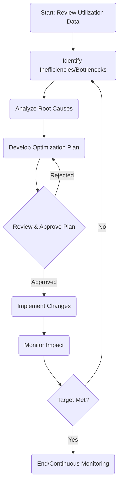

# Resource Optimization Process

## Process Overview
**Type**: Core
**Owner**: [[Resource Analyst]] / [[Operations Manager]]
**Version**: 0.1
**Status**: Draft

## Purpose and Scope
### Purpose
To systematically analyze resource utilization (human, technical, financial) and implement strategies to improve efficiency, reduce waste, and maximize value within the Operations Unit.

### Scope
- **In Scope**: Analysis of all resources managed by the Operations Unit, development and implementation of optimization plans.
- **Out of Scope**: Acquisition of new resource types (handled by strategic planning/finance).

## Process Details
### Prerequisites
1. Access to resource utilization data (timesheets, system logs, financial reports).
2. Defined resource capacity models.
3. [[../Policies/Resources|Resource Management Policy]] in place.

### Inputs
1. Utilization Reports
   - Source: Monitoring Systems, Financial Systems, HR Systems
   - Format: Dashboards, CSV exports
   - Validation: Data accuracy checks

2. Operational Forecasts
   - Source: Sales, Project Management
   - Format: Demand plans, project schedules
   - Validation: Cross-referenced with capacity

### Process Steps

1. Step 1: Data Review & Analysis
   - Action: Collect and review utilization data across all resource types.
   - Actor: Resource Analyst
   - Tools: Analytics Platform, Excel
   - Output: Utilization Analysis Report

2. Step 2: Develop Optimization Plan
   - Action: Propose specific actions (e.g., reallocate staff, adjust schedules, automate tasks, renegotiate contracts).
   - Actor: Resource Analyst, Operations Manager
   - Tools: Planning documents
   - Output: Optimization Plan Proposal

3. Step 3: Implement Changes
   - Action: Execute the approved plan (requires coordination with HR, IT, Finance, affected teams).
   - Actor: Operations Manager, Relevant Leads
   - Tools: Project Management tools, Communication channels
   - Output: Implemented changes

### Outputs
1. Resource Optimization Plan
   - Type: Document
   - Format: Standard template
   - Destination: Operations Director, Stakeholders
   - Usage: Approval and implementation guide

2. Updated Resource Allocation
   - Type: Data/Configuration
   - Format: Updated schedules, system configurations
   - Destination: Operational Systems, Teams
   - Usage: Revised operational execution

## Roles and Responsibilities
- [[Resource Analyst]]: Data collection, analysis, plan drafting.
- [[Operations Manager]]: Plan review, implementation oversight, coordination.
- [[Operations Director]]: Final plan approval, strategic alignment.

## Controls and Metrics
### Process Controls
- Plan Approval Workflow
- Regular Performance Reviews

### Performance Metrics
- Resource Utilization Rate (%)
- Cost Savings Achieved ($)
- Process Throughput Improvement (%)

## Systems and Tools
- [[Analytics Platform]]
- [[Resource Management System]]
- [[Project Management Software]]

## Exceptions and Error Handling
- Inaccurate data leading to flawed analysis.
- Unforeseen external factors impacting resource needs.

## Related Processes
- [[ProcessManagement]]
- [[../Policies/Resources|Resource Management Policy]]
- Financial Budgeting

## Documentation and Training
- Resource Optimization Analysis Template
- Training on data analysis tools and techniques.

## Compliance and Audit
- Adherence to [[../Policies/Resources|Resource Management Policy]].
- Audit trail of optimization decisions and their impact.

## Change Management
- Changes tracked via version control on plans and reports.

---
**Metadata**
- Created: <% tp.date.now("YYYY-MM-DD") %>
- Last Updated: <% tp.date.now("YYYY-MM-DD") %>
- Owner: [[Operations Manager]]
- Contributors: [[Resource Analyst]]
- Review Status: Draft
- Security Classification: Internal 