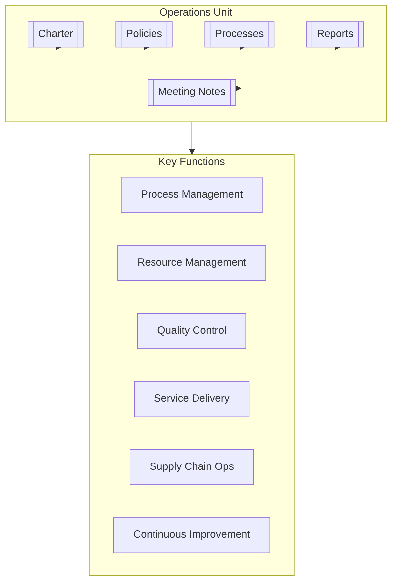

# Operations Unit

## Overview

The Operations Unit is central to the organization's efficiency and effectiveness. It focuses on optimizing processes, managing resources, ensuring quality, and delivering services reliably. This unit drives sustainable operational performance and fosters a culture of continuous improvement across all business functions.

## Key Documents

- **Charter**: [[Charter]] - Defines the unit's purpose, scope, objectives, governance, and structure.
- **Policies**: [[Policies/README|Policies Overview]] - Governs how the unit operates, including:
    - [[Policies/operationsunit|Unit Overview & Interfaces]]
    - [[Policies/PositionsPersonas|Positions & Personas]]
    - [[Policies/Resources|Resource Management]]
    - [[Policies/Responsibilities|Roles & Responsibilities]]
    - [[Policies/SkillsRoles|Skills & Roles]]
- **Processes**: [[Processes/README|Processes Overview]] - Describes core operational workflows, such as:
    - [[Processes/ProcessManagement|Process Management]]
    - [[Processes/ResourceOptimization|Resource Optimization]]
    - [[Processes/QualityControl|Quality Control]]
    - [[Processes/ServiceDelivery|Service Delivery]]
    - [[Processes/SupplyChainManagement|Supply Chain Management]]
- **Meeting Notes**: [[MeetingNotes/README|Meeting Notes]] - Records of discussions, decisions, and action items.
- **Reports**: [[Reports/README|Reports]] - Performance summaries and analyses.

## Purpose

To ensure the smooth, efficient, and effective running of the organization's core operational activities, supporting strategic goals through operational excellence.

## Contact

- **Operations Director**: [[Jamie Lee]]
- **Slack Channel**: `#operations`
