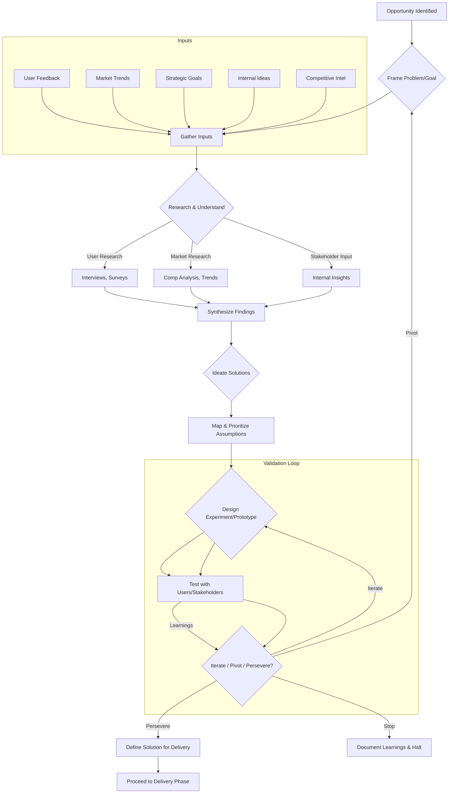

# Product Discovery Process

**Version:** 1.0
**Date:** {{Current Date}}
**Process Owner:** Head of Product
**Applies To:** Product Managers, Designers, Researchers, Engineering Leads, and relevant stakeholders involved in exploring and defining new product opportunities.

## 1. Purpose

This document outlines the standard process for Product Discovery. The goal is to effectively and efficiently explore problems and opportunities, validate assumptions, and define potential solutions that are valuable (customers will choose to use/buy), usable (customers can figure out how to use), feasible (engineers can build with available resources/technology), and viable (solution works for the business).

## 2. Process Overview

Product Discovery is an iterative and often non-linear process focused on learning and reducing uncertainty before committing significant resources to building a solution. It involves deeply understanding the problem space, exploring potential solutions, and validating hypotheses with users and stakeholders.

## 3. Key Activities

*   **Opportunity Identification & Framing:** Identifying potential problems or opportunities from various sources (market trends, user feedback, strategic goals, competitive analysis, internal ideas). Clearly framing the problem to be solved and the target audience.
*   **Research & Understanding:**
    *   **User Research:** Interviews, surveys, ethnographic studies, persona development, journey mapping to understand user needs, behaviors, and pain points. (See [[../Policies/Market_Research_Ethics_Policy.md]])
    *   **Market Research:** Analyzing market size, trends, competitive landscape, and positioning.
    *   **Stakeholder Input:** Gathering insights and constraints from internal stakeholders (Sales, Marketing, Support, Engineering, Legal, etc.).
*   **Ideation & Solution Exploration:** Brainstorming potential solutions to the identified problems. Exploring different approaches and concepts.
*   **Assumption Mapping & Prioritization:** Identifying the riskiest assumptions underlying the potential solutions (related to value, usability, feasibility, viability).
*   **Prototyping & Experimentation:** Creating low-fidelity and high-fidelity prototypes (wireframes, mockups, interactive prototypes) or other experiments (e.g., landing page tests, A/B tests, Wizard of Oz tests) to test assumptions.
*   **Validation & Testing:** Testing prototypes and concepts with target users and stakeholders to gather feedback and validate (or invalidate) assumptions. Iterating based on learnings.
*   **Definition & Handoff (if proceeding):** If validation is successful, defining the solution requirements (e.g., user stories, specifications) for the delivery team. This often involves close collaboration with the delivery team to ensure feasibility and understanding. (See [[Feature_Specification_Process.md]])

## 4. Process Flow (Conceptual)

*Note: This is a conceptual flow; the process is often iterative and steps may be revisited.* 

## 5. Roles & Responsibilities

*   **Product Manager:** Leads the discovery process, coordinates activities, synthesizes information, prioritizes assumptions, and makes recommendations.
*   **UX/UI Designer:** Leads prototyping, usability testing, and user interface design aspects.
*   **User Researcher:** Conducts in-depth user research activities (may be a dedicated role or part of PM/Design).
*   **Engineering Lead/Architect:** Provides input on technical feasibility, constraints, and potential solutions throughout the process.
*   **Stakeholders (Sales, Marketing, Support, etc.):** Provide input, context, and feedback from their respective domains.
*   **Delivery Team:** Often involved later in discovery to understand context, provide feasibility feedback, and prepare for potential handoff.

## 6. Key Artifacts (Examples)

*   Problem Brief / Opportunity Canvas
*   User Personas & Journey Maps
*   Research Findings Summaries
*   Assumption Maps
*   Prototypes (various fidelities)
*   Experiment Designs & Results
*   Validation Reports
*   Solution Proposals / High-Level Requirements (if proceeding)

## 7. Tooling

Discovery activities may utilize tools such as:

*   Collaboration: Miro, FigJam, Confluence
*   Prototyping: Figma, Sketch, Axure
*   User Research: UserTesting.com, Lookback, SurveyMonkey, Dovetail
*   Roadmapping/Idea Management: Aha!, Productboard, Jira

## 8. Process Review

This process will be reviewed periodically (e.g., annually) and refined based on team experience and evolving best practices.

## 9. Related Documents

*   [[../Charter.md]]
*   [[../Policies/Market_Research_Ethics_Policy.md]]
*   [[../Policies/Product_Roadmap_Policy.md]]
*   [[Roadmap_Prioritization_Process.md]]
*   [[Feature_Specification_Process.md]]
*   [[User_Feedback_Collection_Process.md]] 