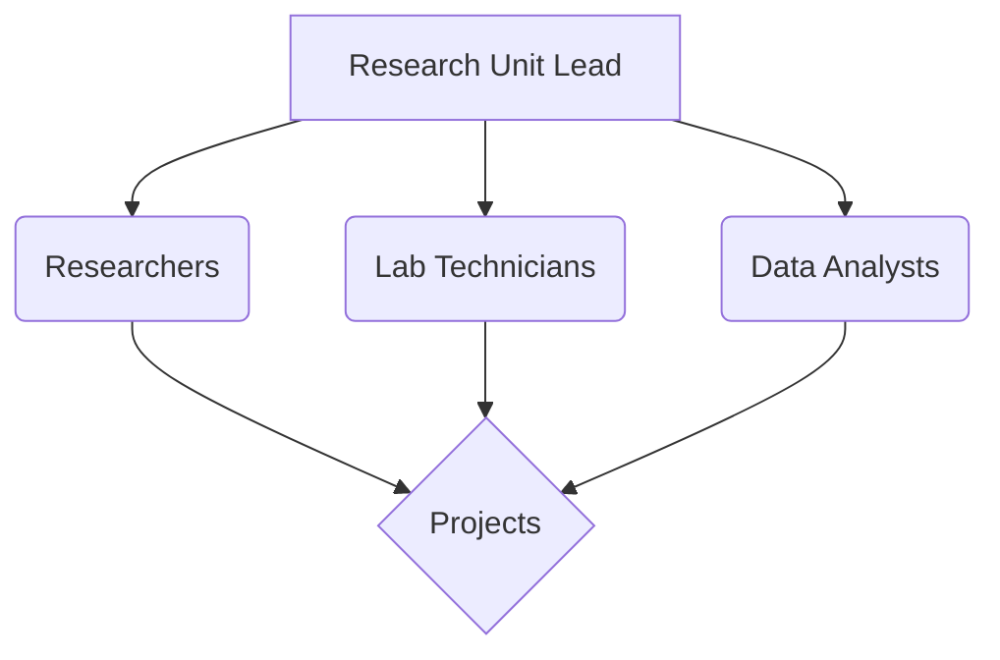

# Research Unit

Responsible for conducting research to drive innovation, inform strategy, and develop new capabilities.

## Overview

The [[index|Research Unit]] focuses on exploring emerging technologies, scientific advancements, and market trends to identify opportunities and challenges relevant to the organization's goals. We aim to generate insights, develop prototypes, and contribute to the knowledge base.

See the full [[Charter]].

## Key Areas

*   **[[FocusAreas|Focus Areas & Projects]]**: Current and planned research initiatives.
*   **[[Structure|Team Structure & Roles]]**: How the unit is organized.
*   **[[Methodologies|Methodologies & Standards]]**: Our approach to research.
*   **[[Tools|Tools & Technologies]]**: Resources we utilize.
*   **[[Collaboration|Collaboration Model]]**: How we work with other units like [[../Development/|Development]], [[../Innovation/|Innovation]], and [[../ProductManagement/|Product Management]].
*   **[[Training_and_Skills/|Training & Skills Development]]**: Continuous learning and expertise building.
*   **[[Policies/|Policies]]**: Guiding principles and regulations.
*   **[[Processes/|Processes]]**: Standard operating procedures.
*   **[[Reports/|Reports & Publications]]**: Dissemination of findings.
*   **[[MeetingNotes/|Meeting Notes]]**: Records of discussions and decisions.

## Key Documents

*   [[Charter.md]] - Defines the purpose, scope, and goals of the Research Unit.
*   [[Policies/]] - Contains policies governing research activities (e.g., Ethics, Data Handling, Publication).
*   [[Processes/]] - Outlines standard operating procedures and workflows for research projects.
*   [[Reports/]] - Archives research findings, reports, and publications.
*   [[MeetingNotes/]] - Contains records of meetings related to the Research Unit.

## Structure (Conceptual)

## Contact

*   **Lead:** [Name/Contact Info]
*   **General Inquiries:** [Email/Channel]
