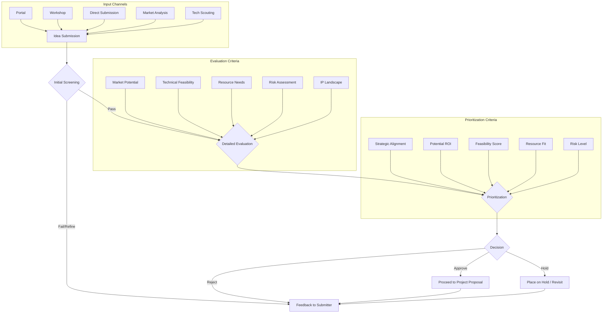

# R&D Idea Generation Process

## 1. Purpose

To establish a systematic approach for soliciting, collecting, evaluating, and prioritizing new ideas for Research & Development projects, fostering innovation and aligning R&D efforts with strategic goals.

## 2. Scope

This process applies to all potential sources of R&D ideas, including internal personnel across all departments, external partners, market analysis, technology scouting, and customer feedback.

## 3. Process Steps

1.  **Idea Submission:** Ideas can be submitted through various channels (e.g., dedicated portal, workshops, direct submission to R&D personnel).
    *   Submissions should include: Idea description, potential benefits/impact, alignment with strategy, required resources (preliminary), submitter details.
2.  **Initial Screening:** The R&D Unit (or a designated committee) performs an initial screening based on:
    *   Clarity and completeness of the idea.
    *   Apparent alignment with the R&D Charter and organizational strategy.
    *   Avoiding duplication with existing projects.
    *   Basic feasibility check.
    *   *Outcome:* Proceed to evaluation or provide feedback to the submitter if rejected/needs refinement.
3.  **Detailed Evaluation:** Ideas passing the initial screen undergo a more detailed evaluation. This may involve:
    *   Market potential analysis.
    *   Technical feasibility assessment.
    *   Resource estimation (personnel, budget, time).
    *   Risk assessment.
    *   IP landscape review.
    *   Input from subject matter experts.
4.  **Prioritization:** Evaluated ideas are prioritized based on criteria such as:
    *   Strategic alignment score.
    *   Potential ROI / Value creation.
    *   Technical feasibility score.
    *   Resource requirements vs. availability.
    *   Risk level.
5.  **Decision:** Based on prioritization, a decision is made:
    *   **Approve:** Idea moves to the Project Proposal phase.
    *   **Hold:** Idea is promising but deferred due to resource constraints or timing. Revisit periodically.
    *   **Reject:** Idea is not pursued. Provide feedback to the submitter.
6.  **Feedback:** Feedback is provided to the submitter regarding the outcome of their idea.

## 4. Process Flowchart (Mermaid)

## 5. Roles and Responsibilities

-   **Submitters:** Provide clear and comprehensive idea descriptions.
-   **R&D Unit / Idea Committee:** Manage the process, conduct screening and evaluation, facilitate prioritization, and make decisions.
-   **Subject Matter Experts:** Provide input during the detailed evaluation phase.

## 6. Tools and Templates

-   Idea Submission Form/Portal
-   Evaluation Checklist/Scorecard
-   Prioritization Matrix

## 7. Review

This process will be reviewed periodically to ensure its effectiveness and efficiency. 