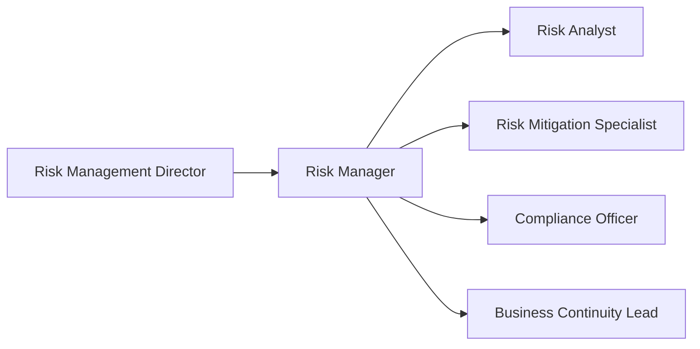
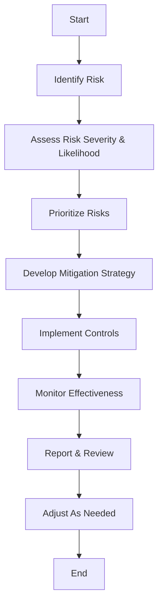

# Risk Management Unit Charter

## 📋 Charter Overview
### Purpose
The Risk Management Unit is responsible for developing and implementing a comprehensive risk management framework that identifies, assesses, mitigates, and monitors risks across the organization to protect value and ensure resilience.

### Scope
- Areas of responsibility: Enterprise risk management, risk assessment, mitigation strategies, risk monitoring.
- Jurisdictional boundaries: Organization-wide, cross-functional with all business units.
- Operational domains: Strategic, operational, financial, compliance, and reputational risks.
- Geographic coverage: Global risk management.

## 🎯 Objectives and Goals
### Primary Objectives
1. Establish and maintain a comprehensive enterprise risk management framework.
2. Develop and implement risk assessment methodologies across all risk domains.
3. Coordinate risk mitigation strategies and monitor their effectiveness.
4. Foster a risk-aware culture throughout the organization.

### Strategic Goals
1. Reduce high-severity risk incidents by 30% within 18 months.
2. Achieve 100% compliance with regulatory risk management requirements.
3. Implement quarterly risk reviews across all business units.
4. Establish risk appetite frameworks for all major organizational initiatives.

## 👥 Membership and Structure
### Composition
- Leadership roles: Risk Management Director, Risk Manager.
- Core members: Risk Analyst, Risk Mitigation Specialist, Compliance Officer, Business Continuity Lead.
- Advisory members: Legal Counsel, Finance Representative, Operations Lead.
- Support staff: Risk Documentation Specialist.

### Roles and Responsibilities
#### Chair/Leader
- Appointment process: Appointed by CEO and Board Risk Committee.
- Term duration: 3-year term, renewable.
- Key responsibilities: Establish risk management strategy, approve risk policies, oversee enterprise risk portfolio.
- Authority limits: Risk acceptance up to defined thresholds per the Risk Appetite Framework.

#### Members
- Selection criteria: Demonstrated expertise in risk management, relevant certifications (e.g., CRISC, CRMA).
- Term limits: 2-year term, staggered to ensure continuity.
- Core duties: Execute risk assessments, develop mitigation strategies, monitor risk controls.
- Expected contributions: Risk analysis, control design, reporting metrics.

#### Support Roles
- Administrative support: Documentation management, meeting coordination.
- Technical advisors: Provide specialized risk domain expertise.
- Subject matter experts: Offer insights on specific risk areas.
- External consultants: Engage for specialized risk assessment methodologies.

## 🔧 Governance Structure
### Decision Making
- Voting procedures: Simple majority of sitting members.
- Quorum requirements: Minimum 60% of core members.
- Decision thresholds: >3/4 majority for major risk policy changes.
- Veto powers: Chair has veto rights on risk acceptance decisions.

### Meeting Structure
- Frequency: Weekly risk review meetings.
- Format: Hybrid (in-person and virtual).
- Required attendance: All core members.
- Documentation requirements: Risk decisions, actions, and updates documented within 24 hours.

### Reporting Lines
- Hierarchical structure: Director → Risk Committee → Board of Directors.
- Communication channels: Slack (#risk-management), email distribution list.
- Escalation paths: Escalate critical risks to Executive Committee.
- Accountability framework: Quarterly risk reports to Board Risk Committee.

## 📊 Risk Management Process Flow

## 📊 Operations
### Regular Activities
- Scheduled meetings: Weekly risk review meetings.
- Review cycles: Monthly risk control assessments.
- Reporting requirements: Weekly risk dashboards, monthly comprehensive reports.
- Standard procedures: Risk assessment, control testing, incident response.

### Special Activities
- Special sessions: Quarterly enterprise risk workshops.
- Emergency procedures: Crisis management activation.
- Ad-hoc committees: Emerging risk task force.
- Task forces: Regulatory compliance and risk audit teams.

### Working Groups
- Formation process: Proposal submitted to Director with risk domain focus.
- Scope definition: Detailed in group charter with explicit risk mandate.
- Leadership selection: Appointed by Risk Management Director.
- Reporting requirements: Bi-weekly updates to main unit.

## 🎯 Authority and Responsibilities
### Authority Levels
- Decision-making powers: Establish risk management frameworks and methodologies.
- Resource allocation: Approve resources for risk mitigation initiatives.
- Policy setting: Develop and implement risk policies and procedures.
- Enforcement capabilities: Enforce risk limits and controls.

### Key Responsibilities
- Strategic planning: Develop enterprise risk management strategy.
- Policy development: Create and maintain risk policies and procedures.
- Oversight functions: Monitor adherence to risk controls.
- Risk management: Identify, assess, mitigate, and monitor organizational risks.

### Limitations
- Scope restrictions: Risk acceptance beyond thresholds requires Board approval.
- Authority boundaries: Cannot override Board-approved risk appetite.
- Resource constraints: Subject to annual budget allocations.
- Compliance requirements: Must adhere to regulatory and governance frameworks.

## 📈 Performance and Accountability
### Success Metrics
- Performance indicators: Risk incident rate, control effectiveness, time to remediate.
- Quality measures: Accuracy of risk assessments, completeness of risk register.
- Impact assessment: Loss avoidance, value preservation.
- Effectiveness evaluation: Quarterly risk management scorecard.

### Review Process
- Performance reviews: Monthly and quarterly.
- Charter updates: Annual review by the unit.
- Member evaluations: 360-degree feedback on risk management effectiveness.
- Effectiveness assessment: Annual risk management maturity assessment.

### Accountability Measures
- Reporting requirements: Weekly dashboards, monthly comprehensive reports.
- Audit procedures: Internal risk audits quarterly.
- Compliance monitoring: Continuous monitoring with monthly attestation.
- Corrective actions: Formal risk remediation plans with tracking.

## 🤝 Stakeholder Engagement
### Internal Stakeholders
- Communication methods: Risk bulletins, dashboards, training sessions.
- Engagement frequency: Weekly updates, quarterly deep dives.
- Feedback mechanisms: Risk surveys and workshops.
- Collaboration frameworks: Cross-functional risk committees.

### External Stakeholders
- Relationship management: Regulator engagement, insurer relations.
- Communication channels: Formal reporting, disclosure frameworks.
- Engagement protocols: Regulatory examination support.
- Partnership agreements: Third-party risk management frameworks.

## 📝 Documentation and Reporting
### Required Documentation
- Meeting minutes: Stored in risk documentation repository.
- Decision records: Documented in GRC system.
- Action items: Tracked in risk management tool.
- Progress reports: Distributed weekly to key stakeholders.

### Reporting Requirements
- Report types: Risk dashboard, incident report, control assessment, emerging risk report.
- Frequency: Weekly, monthly, and quarterly.
- Distribution: Executive Committee, Board Risk Committee, and relevant stakeholders.
- Review process: Peer review and Director approval before distribution.

## 🔒 Compliance and Ethics
### Regulatory Compliance
- Applicable regulations: SOX, GDPR, industry-specific regulations.
- Compliance requirements: Risk-based compliance assessments.
- Monitoring procedures: Continuous control monitoring.
- Reporting obligations: Quarterly compliance status reporting.

### Ethical Standards
- Code of conduct: Follow corporate ethics policy.
- Conflict of interest: Declare potential conflicts in risk decisions.
- Confidentiality: Protect sensitive risk information.
- Professional standards: Adhere to ISO 31000, COSO ERM, and industry standards.

## 🔄 Amendment Process
### Charter Updates
- Review frequency: Annual or after significant organizational changes.
- Update procedures: Propose change, review impact, revise.
- Approval process: Vote by unit members, Director approval.
- Implementation timeline: Published within two weeks of approval.

### Version Control
- Document history: Maintained in documentation system.
- Change tracking: Via documentation version control.
- Approval records: Stored in governance records.
- Distribution updates: Notified via email and announcements.

## 📊 Resource Management
### Financial Resources
- Budget allocation: Annual risk management budget planning.
- Expense management: Monthly budget reviews.
- Financial reporting: Quarterly expenditure reports.
- Audit requirements: Annual budget utilization audit.

### Human Resources
- Staffing needs: Assessed quarterly against risk profile.
- Training requirements: Defined in risk capability development plan.
- Performance management: Quarterly risk KPI reviews.
- Succession planning: Documented for all key risk roles.

## 📝 Notes and References
### Supporting Documents
- Related policies: [[Policies/riskmanagementunit|Risk Management Framework]].
- Procedures: [[Processes/RiskAssessment|Risk Assessment Methodology]].
- Guidelines: [[Policies/RiskAppetite|Risk Appetite Framework]].
- Standards: [[Processes/RiskMonitoring|Risk Monitoring Standards]].

### Historical Context
- Formation history: Established in 2012 following strategic risk review.
- Major milestones: Enterprise Risk Management implementation in 2014, GRC system deployment in 2018.
- Integration: Works closely with [[../Operations/README|Operations Unit]] on operational risk management.

## 🔗 Cross-Unit Connections
- [[../Operations/README|Operations Unit]]: Joint operational risk assessments and business continuity coordination.
- [[../Compliance/README|Compliance Unit]]: Regulatory risk management and compliance monitoring.
- [[../Security/README|Security Unit]]: Information security risk assessments and mitigation strategies.
- [[../Finance/README|Finance Unit]]: Financial risk management and reporting.

---
**Version:** 1.0
**Approval Date:** [Date]
**Approved By:** [[Risk Committee Chair]] / [[CEO]]
**Next Review Date:** [Date + 1 Year]
