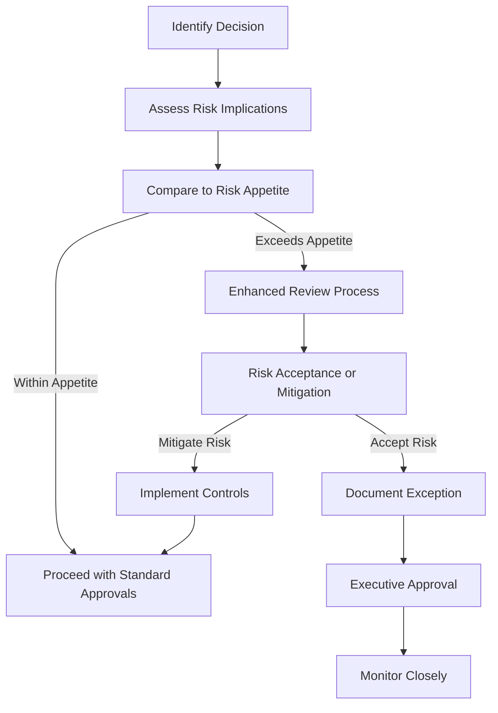

# Risk Appetite Framework

## Purpose

This policy establishes the organization's risk appetite framework, defining the amount and type of risk the organization is willing to accept in pursuit of its strategic objectives. It provides guidance for decision-making and ensures alignment between risk-taking activities and organizational goals.

## Scope

This framework applies to all business units, functions, and personnel within the organization. It covers all risk categories including strategic, operational, financial, compliance, and reputational risks.

## Definitions

- **Risk Appetite**: The aggregate level and types of risk the organization is willing to assume to achieve its strategic objectives.
- **Risk Tolerance**: The specific maximum risk the organization is willing to take regarding each relevant risk category.
- **Risk Capacity**: The maximum level of risk the organization can assume given its current resources.
- **Risk Profile**: The organization's entire risk landscape at a specific point in time.
- **Key Risk Indicator (KRI)**: A metric used to indicate the level of risk exposure.

## Risk Appetite Statement

The organization maintains a balanced approach to risk, recognizing that controlled risk-taking is essential for innovation and growth. We commit to:

1. Prioritizing risks to safety, security, compliance, and reputation above all others
2. Maintaining financial stability through prudent financial risk management
3. Taking calculated risks in pursuit of strategic growth and innovation
4. Ensuring operational resilience through robust business continuity measures
5. Safeguarding data integrity and privacy through effective information security

## Risk Tolerance Levels

Risk tolerance is defined at both the enterprise and unit levels using a five-point scale:

| Level | Description | Approach | Example |
|-------|-------------|----------|---------|
| 1 - Averse | No appetite for this risk | Avoid or eliminate | Compliance violations |
| 2 - Minimal | Very limited acceptance | Mitigate extensively | Information security breaches |
| 3 - Cautious | Willing to accept some risk | Balance risk and return | Operational changes |
| 4 - Open | Comfortable accepting risk | Accept with monitoring | Product innovations |
| 5 - Seeking | Actively seeking opportunity | Embrace with controls | Strategic growth initiatives |

## Risk Category Tolerances

| Risk Category | Tolerance Level | Key Risk Indicators | Escalation Threshold |
|---------------|-----------------|---------------------|----------------------|
| Strategic | 3-5 | Strategic plan variance, Market share | >15% variance from plan |
| Financial | 1-3 | Liquidity ratio, Debt to equity | <1.2 liquidity ratio |
| Operational | 2-4 | Process failures, Downtime | >2 hours of critical system downtime |
| Compliance | 1-2 | Compliance violations, Audit findings | Any critical findings |
| Reputational | 1-3 | Media sentiment, Customer satisfaction | >10% drop in satisfaction |
| Information Security | 1-2 | Security incidents, Vulnerability density | Any data breach |

## Application of Risk Appetite

The Risk Appetite Framework shall be applied throughout the organization in the following ways:

1. **Strategic Planning**: Risk appetite considerations must be integrated into strategic planning processes.
2. **Decision-Making**: Major decisions must include assessment against the risk appetite framework.
3. **Resource Allocation**: Resources for risk mitigation should align with risk appetite priorities.
4. **Performance Management**: Risk management effectiveness is included in performance evaluations.
5. **Operations**: Operational processes must incorporate appropriate risk controls based on tolerance levels.

## Roles and Responsibilities

| Role | Responsibilities |
|------|------------------|
| Board of Directors | Approve risk appetite framework; oversee adherence |
| Executive Committee | Implement framework; align business strategy with risk appetite |
| Risk Management Unit | Monitor adherence; report on risk profile vs. appetite |
| Business Unit Leaders | Apply risk appetite within their functional areas |
| All Employees | Understand risk appetite relevant to their roles |

## Governance and Review

1. The Risk Appetite Framework shall be reviewed annually by the [[../README|Risk Management Unit]] and approved by the Board.
2. Quarterly assessment of the organization's risk profile against the defined appetite shall be conducted.
3. Material changes to the risk environment that affect the organization's ability to operate within its appetite shall be escalated to the Executive Committee.
4. The [[../../Operations/README|Operations Unit]] and Risk Management shall conduct joint reviews of operational risks against appetite semi-annually.

## Risk Appetite in Decision-Making

## Exceptions and Escalations

1. Exceptions to the risk appetite require documented justification and approval according to the Delegation of Authority matrix.
2. Risks exceeding tolerance levels shall be escalated according to the following path:
   - Level 1-2 (Low-Medium): Risk Owner → Unit Leader
   - Level 3 (High): Unit Leader → Risk Management Director
   - Level 4-5 (Very High-Critical): Risk Management Director → Executive Committee → Board

## Related Resources

- [[Responsibilities|Roles & Responsibilities Policy]]
- [[../Processes/RiskAssessment|Risk Assessment Process]]
- [[../../Operations/Policies/operationsunit|Operations Unit Policy]]
- [[../../Compliance/Policies/README|Compliance Policies]]

## Document Control

| Version | Date | Approved By | Changes |
|---------|------|-------------|---------|
| 1.0 | YYYY-MM-DD | Board of Directors | Initial policy |

---

**Policy Owner**: Risk Management Director  
**Last Review**: YYYY-MM-DD  
**Next Review**: YYYY-MM-DD 