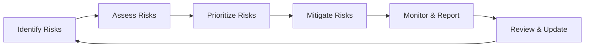

# Risk Management Processes

This directory contains the core processes and methodologies that guide risk management activities across the organization.

## Purpose

These processes establish standardized, repeatable approaches for identifying, assessing, mitigating, monitoring, and reporting risks. They ensure consistency in how the organization manages risks across different business units and risk domains.

## Key Processes

| Process | Description |
|---------|-------------|
| [Risk Identification](RiskIdentification.md) | Methodologies and procedures for identifying risks across the organization |
| [Risk Assessment](RiskAssessment.md) | Framework for evaluating and prioritizing risks based on impact and likelihood |
| [Risk Mitigation](RiskMitigation.md) | Approaches for developing and implementing risk treatment strategies |
| [Risk Monitoring](RiskMonitoring.md) | Procedures for ongoing monitoring of risks and control effectiveness |
| [Business Continuity](BusinessContinuity.md) | Processes for ensuring operational resilience and business continuity |

## Process Flow

The risk management lifecycle follows this general flow:

## Integration Points

- **Operations Integration**: [[../../Operations/Processes/ProcessManagement|Process Management]] - Coordination on operational risk controls
- **Compliance Integration**: Risk-based compliance assessment processes
- **Audit Integration**: Alignment with internal audit methodologies
- **Strategy Integration**: Risk inputs into strategic planning process

## Tools and Templates

- Risk Register Template
- Risk Assessment Matrix
- Control Testing Methodology
- Risk Reporting Templates

## Related Resources

- [[../Policies/README|Risk Management Policies]]
- [[../../Operations/Processes/README|Operations Processes]]
- [[../Reports/README|Risk Management Reports]]

## Contact

For questions about these processes, contact the Risk Management team at risk@organization.com or via Slack at #risk-management. 