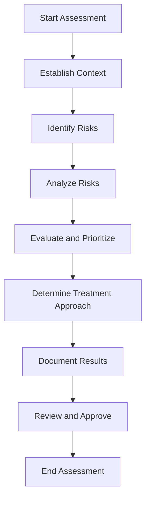

# Risk Assessment Process

## Purpose

This document outlines the standardized methodology for identifying, analyzing, and evaluating risks across the organization. It ensures a consistent approach to risk assessment that enables effective prioritization and treatment of risks.

## Scope

This process applies to all risk assessments conducted within the organization, including:
- Strategic initiatives and projects
- Operational processes and activities
- New products and services
- Organizational changes
- Third-party relationships
- Information systems and technologies

## Process Overview

## Detailed Process Steps

### 1. Establish Context

**Purpose**: Define the objectives, scope, and parameters of the assessment.

**Activities**:
- Define assessment objectives and scope
- Identify key stakeholders and participants
- Determine assessment timeframe and resources
- Review relevant documentation and previous assessments
- Identify applicable [[../Policies/RiskAppetite|Risk Appetite]] thresholds

**Outputs**:
- Risk Assessment Plan

**Integration with Operations**:
- Coordinate with [[../../Operations/README|Operations Unit]] to understand operational context
- Leverage [[../../Operations/Processes/ProcessManagement|Process Management]] documentation

### 2. Identify Risks

**Purpose**: Identify all potential events that could affect objectives.

**Activities**:
- Conduct facilitated workshops with key stakeholders
- Perform document reviews and gap analyses
- Analyze processes, systems, and activities
- Consider internal and external factors
- Use structured identification methods (e.g., checklists, scenarios)

**Outputs**:
- Comprehensive list of identified risks
- Initial risk descriptions

**Tools and Techniques**:
- Risk identification workshops
- Process flow analysis
- SWOT analysis
- Failure mode and effects analysis (FMEA)
- Structured interviews

### 3. Analyze Risks

**Purpose**: Determine risk characteristics including causes, consequences, likelihood, and impact.

**Activities**:
- Identify risk causes and triggers
- Determine potential consequences
- Assess existing controls and their effectiveness
- Estimate likelihood and impact
- Consider interdependencies between risks

**Risk Assessment Matrix**:

| Likelihood / Impact | Negligible (1) | Minor (2) | Moderate (3) | Major (4) | Severe (5) |
|---------------------|----------------|-----------|--------------|-----------|------------|
| Almost Certain (5)  | Medium (5)     | High (10) | High (15)    | Critical (20) | Critical (25) |
| Likely (4)          | Medium (4)     | Medium (8) | High (12)    | High (16)    | Critical (20) |
| Possible (3)        | Low (3)        | Medium (6) | Medium (9)   | High (12)    | High (15)     |
| Unlikely (2)        | Low (2)        | Low (4)   | Medium (6)   | Medium (8)   | High (10)     |
| Rare (1)            | Low (1)        | Low (2)   | Low (3)      | Medium (4)   | Medium (5)    |

**Impact Assessment Criteria**:

| Category | Negligible (1) | Minor (2) | Moderate (3) | Major (4) | Severe (5) |
|----------|----------------|-----------|--------------|-----------|------------|
| Financial | <$10K | $10K-$100K | $100K-$1M | $1M-$10M | >$10M |
| Operational | <2 hours disruption | 2-8 hours disruption | 8-24 hours disruption | 1-3 days disruption | >3 days disruption |
| Reputation | Minimal attention | Local media attention | Regional media coverage | National coverage | International crisis |
| Compliance | Minor violation | Reportable incident | Regulatory inquiry | Investigation with penalties | Significant sanctions |
| Safety | First aid case | Medical treatment | Lost time injury | Permanent disability | Fatality |

**Outputs**:
- Detailed risk analysis
- Inherent and residual risk ratings

### 4. Evaluate and Prioritize

**Purpose**: Compare risk analysis results with risk criteria to determine treatment priorities.

**Activities**:
- Compare risk levels against established criteria
- Prioritize risks based on rating and organizational impact
- Consider aggregated and interrelated risks
- Validate with key stakeholders

**Risk Evaluation Criteria**:
- Critical (17-25): Immediate action required; executive oversight
- High (10-16): Prompt action required; senior management attention
- Medium (5-9): Specific management responsibility assigned
- Low (1-4): Manage through routine procedures

**Outputs**:
- Prioritized risk register
- Initial treatment recommendations

### 5. Determine Treatment Approach

**Purpose**: Define appropriate risk treatment strategies.

**Activities**:
- Select treatment options (avoid, mitigate, transfer, accept)
- Consider cost-benefit analysis of treatment options
- Align with [[../Policies/RiskAppetite|Risk Appetite]]
- Validate feasibility of proposed treatments

**Treatment Options**:
- **Avoid**: Eliminate the activity or condition
- **Mitigate**: Reduce likelihood and/or impact through controls
- **Transfer**: Share risk through insurance, contracts, partnerships
- **Accept**: Acknowledge and monitor risk within appetite

**Outputs**:
- Treatment recommendations
- Implementation considerations

### 6. Document Results

**Purpose**: Record assessment findings and recommendations.

**Activities**:
- Document methodology and process
- Record identified risks and their ratings
- Document treatment recommendations
- Update risk register

**Outputs**:
- Risk assessment report
- Updated risk register
- Treatment action plans

### 7. Review and Approve

**Purpose**: Ensure assessment quality and obtain necessary approvals.

**Activities**:
- Review assessment methodology and findings
- Validate with key stakeholders
- Obtain required approvals
- Communicate results to affected parties

**Outputs**:
- Approved risk assessment
- Communication plan

## Roles and Responsibilities

| Role | Responsibilities |
|------|------------------|
| Risk Owner | Participates in assessment; owns identified risks; implements treatments |
| Risk Facilitator | Conducts assessment; applies methodology; documents results |
| Risk Management Unit | Provides expertise and guidance; reviews quality |
| Business Unit Leaders | Ensure participation; validate findings; approve within authority |
| Operations Unit | Provide operational context; validate operational impacts |

## Integration with Other Processes

- [[RiskIdentification|Risk Identification Process]]: Feeds into the assessment process
- [[RiskMitigation|Risk Mitigation Process]]: Receives treatment recommendations
- [[RiskMonitoring|Risk Monitoring Process]]: Establishes baseline for monitoring
- [[../../Operations/Processes/ProcessManagement|Operations Process Management]]: Provides context for operational risks
- [[../../Operations/Processes/QualityControl|Quality Control Process]]: Aligns with risk control effectiveness

## Tools and Templates

- Risk Assessment Planning Template
- Risk Workshop Facilitation Guide
- Risk Assessment Matrix
- Control Effectiveness Evaluation Tool
- Risk Register Template

## References

- [[../Policies/RiskAppetite|Risk Appetite Framework]]
- [[../README|Risk Management Unit Charter]]
- ISO 31000 Risk Management Standards
- COSO ERM Framework

## Document Control

| Version | Date | Author | Changes |
|---------|------|--------|---------|
| 1.0 | YYYY-MM-DD | Risk Management | Initial process |

---

**Process Owner**: Risk Assessment Lead  
**Last Review**: YYYY-MM-DD  
**Next Review**: YYYY-MM-DD 