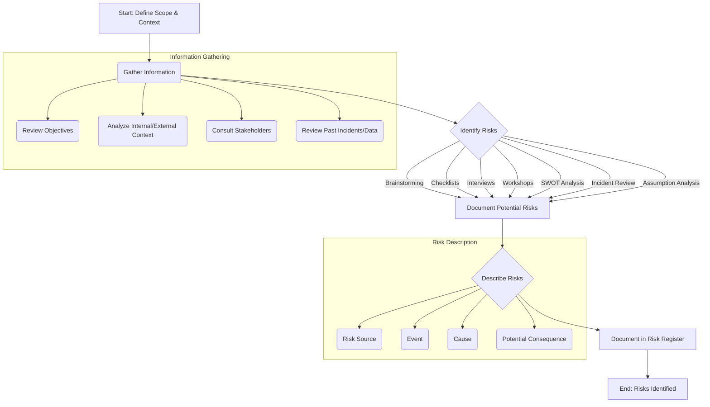

# Risk Identification Process

## 1. Purpose
To systematically and proactively identify potential risks that could hinder the achievement of organizational objectives. This process aims to create a comprehensive inventory of risks for further analysis and evaluation.

## 2. Scope
This process applies to all levels and functions of the organization, including strategic, operational, project, and compliance-related activities.

## 3. Process Steps

### 3.1. Define Scope and Context
- **Activity:** Clearly define the scope of the risk identification exercise (e.g., specific project, process, unit, or enterprise-wide).
- **Activity:** Understand the internal and external context, including strategic objectives, operational environment, stakeholders, regulatory requirements, and organizational capabilities.
- **Responsibility:** Risk Management Unit (RMU), Process/Project/Unit Owner.

### 3.2. Gather Information
- **Activity:** Collect relevant information through various means:
    - Reviewing strategic plans, objectives, and performance reports.
    - Analyzing internal policies, procedures, and organizational structure.
    - Examining the external environment (PESTLE analysis: Political, Economic, Social, Technological, Legal, Environmental).
    - Consulting with key stakeholders (internal and external).
    - Reviewing historical data, incident logs, audit reports, and lessons learned.
- **Responsibility:** RMU, Process/Project/Unit Owner, Relevant Subject Matter Experts (SMEs).

### 3.3. Identify Risks
- **Activity:** Employ various techniques to identify potential risk events, sources, causes, and consequences. Techniques may include:
    - **Brainstorming:** Open discussions with relevant teams/stakeholders.
    - **Checklists:** Using predefined lists based on past experience or industry standards.
    - **Interviews:** Conducting structured or semi-structured interviews with key personnel.
    - **Workshops:** Facilitated sessions involving cross-functional teams.
    - **SWOT Analysis:** Identifying Strengths, Weaknesses, Opportunities, and Threats.
    - **Incident Review:** Analyzing past failures, near misses, and successes.
    - **Assumption Analysis:** Challenging the assumptions underlying plans and objectives.
    - **Scenario Analysis:** Exploring potential future events and their impacts.
- **Responsibility:** RMU (facilitator), Process/Project/Unit Owner, Team Members, SMEs.

### 3.4. Describe Risks
- **Activity:** Clearly articulate each identified risk, ensuring it is well-defined and understandable. The description should ideally include:
    - **Risk Source:** Where the risk originates (e.g., market volatility, system failure, human error).
    - **Event:** What could happen (e.g., data breach, project delay, regulatory fine).
    - **Cause:** Why the event might occur (e.g., lack of controls, inadequate training, external cyberattack).
    - **Potential Consequence:** The impact on objectives if the event occurs (e.g., financial loss, reputational damage, operational disruption).
- **Responsibility:** Risk Identifier, Process/Project/Unit Owner, RMU.

### 3.5. Document in Risk Register
- **Activity:** Record all identified and described risks in the official [[Risk Register]]. Initial documentation should include the risk description, potential causes, consequences, and the area/process affected.
- **Responsibility:** RMU, Process/Project/Unit Owner.

## 4. Inputs
- Organizational Objectives and Strategies
- Internal/External Context Analysis (PESTLE, SWOT)
- Stakeholder Input
- Historical Data (Incidents, Audits, Lessons Learned)
- Policies and Procedures
- Project Plans / Process Maps
- Assumptions Log

## 5. Outputs
- Updated [[Risk Register]] with newly identified risks.
- Comprehensive list of potential risks requiring further analysis.

## 6. Tools and Techniques
- Brainstorming
- Checklists
- Interviews
- Facilitated Workshops
- SWOT Analysis
- PESTLE Analysis
- Root Cause Analysis (for understanding causes)
- Assumption Analysis
- Scenario Analysis
- Risk Register Software/Template

## 7. Roles and Responsibilities
- **Risk Management Unit (RMU):** Facilitates the process, provides tools/templates, maintains the central Risk Register, provides guidance.
- **Process/Project/Unit Owners:** Lead identification within their scope, provide context, engage their teams.
- **Employees/Team Members:** Participate actively, identify risks based on their expertise and experience.
- **Subject Matter Experts (SMEs):** Provide specialized knowledge for identifying specific types of risks (e.g., IT, Legal, Finance).

## 8. Review and Update
- The list of identified risks should be reviewed periodically (e.g., quarterly, annually, or upon significant changes) to ensure relevance and completeness.
- This process document will be reviewed annually by the RMU.

---
**Version:** 1.0
**Effective Date:** [Date]
**Process Owner:** Head of [[Risk Management]]
**Next Review Date:** [Date + 1 Year] 