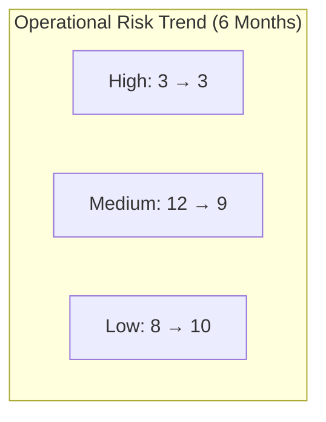
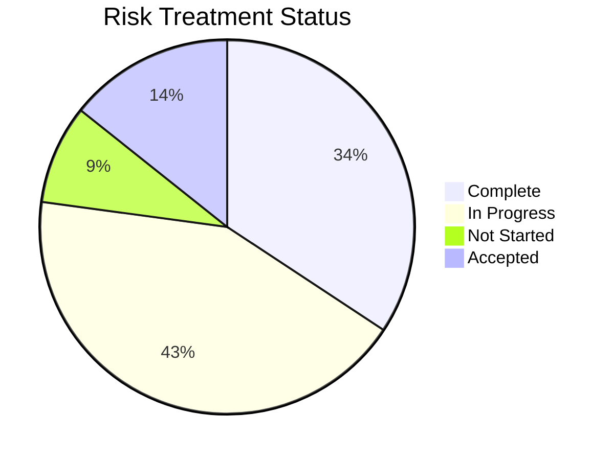

# Joint Risk-Operations Monthly Report - May 2023

## Executive Summary

This report presents a consolidated view of operational risks across the organization based on joint assessment by the [[../README|Risk Management Unit]] and [[../../Operations/README|Operations Unit]]. The current operational risk profile shows a **Moderate** overall risk level with three high-priority items requiring executive attention. Operational resilience metrics show improvement over the previous quarter, with mean time to recovery reduced by 22%.

## Key Metrics

| Metric | Current | Previous | Trend | Target |
|--------|---------|----------|-------|--------|
| Critical Process Availability | 99.7% | 99.2% | ↑ | 99.8% |
| Control Effectiveness Score | 3.6/5 | 3.3/5 | ↑ | 4.0/5 |
| Process Compliance Rate | 94% | 92% | ↑ | 95% |
| Mean Time to Recovery | 42 min | 54 min | ↑ | 30 min |
| Operational Risk Incidents | 5 | 8 | ↑ | <4 |

## Critical and High Risk Status

### Critical Risks (0)

*No critical operational risks identified in this period.*

### High Risks (3)

#### HR-OPS-2023-05: Supply Chain Disruption - Tier 1 Supplier
- **Risk Rating**: High (Likelihood: 4, Impact: 4)
- **Risk Owner**: [[../../Operations/README|Supply Chain Manager]]
- **Mitigation Status**: In Progress (60%)
- **Key Actions**:
  - Alternate supplier identification complete
  - Contract negotiations underway
  - Inventory buffer increased to 45 days
- **Due Date**: July 15, 2023
- **Required Decisions**: Approval for expedited onboarding of secondary supplier

#### HR-OPS-2023-04: Legacy System Failure - Financial Processing
- **Risk Rating**: High (Likelihood: 3, Impact: 5)
- **Risk Owner**: [[../../InformationTechnology/README|IT Director]]
- **Mitigation Status**: In Progress (75%)
- **Key Actions**:
  - System replacement project on track
  - Enhanced monitoring implemented
  - Business continuity procedures tested
- **Due Date**: August 30, 2023

#### HR-OPS-2023-02: Staff Shortage - Customer Support
- **Risk Rating**: High (Likelihood: 5, Impact: 3)
- **Risk Owner**: [[../../CustomerSupport/README|Customer Support Director]]
- **Mitigation Status**: In Progress (40%)
- **Key Actions**:
  - Cross-training program initiated
  - Temporary staff onboarded
  - Process automation assessment underway
- **Due Date**: June 30, 2023

## Mitigation Activities

| Priority | Total Actions | On Track | Delayed | Completed |
|----------|---------------|----------|---------|-----------|
| High | 12 | 9 | 3 | 4 |
| Medium | 18 | 15 | 3 | 7 |
| Low | 5 | 5 | 0 | 1 |

## Process Control Improvements

Based on joint [[../../Operations/Processes/QualityControl|Quality Control]] and risk assessments, the following process control improvements have been implemented:

1. **Order Fulfillment Process**
   - Automated verification checkpoint added
   - Exception handling procedure updated
   - [[../../Operations/Processes/ProcessManagement|Process documentation]] updated

2. **Customer Data Management**
   - Access control restrictions enhanced
   - Data validation controls strengthened
   - Audit trail monitoring expanded

3. **Financial Reconciliation**
   - Approval threshold review completed
   - Daily reconciliation checks implemented
   - [[../../Operations/Processes/ResourceOptimization|Resource optimization]] achieved through automation

## Emerging Concerns

### Technology Infrastructure
Increasing reliance on cloud services has introduced new dependencies. Joint assessment with IT reveals potential availability risks. Recommend developing enhanced resilience requirements and supplier management controls.

### Regulatory Changes
Upcoming regulatory changes in data protection will impact operational processes. Cross-functional working group established with [[../../Compliance/README|Compliance Unit]] to assess impact and develop implementation plan.

## Recommendations

1. **Executive Approval Needed**: Expedite approval for alternate supplier onboarding to address supply chain risk (HR-OPS-2023-05)
2. **Resource Allocation**: Increase resource allocation to customer support cross-training program
3. **Policy Update**: Review and update operational resilience policies to align with new business continuity standards
4. **Technology Investment**: Prioritize legacy system replacement to mitigate operational technology risks

## Joint Operations-Risk Initiatives

1. **Process Risk Assessment Program**
   - Status: On track
   - Joint responsibility: [[../README|Risk Analyst]] and [[../../Operations/README|Process Engineer]]
   - Next milestone: Q2 assessment completion (June 30)

2. **Operational Resilience Framework**
   - Status: On track
   - Joint responsibility: [[../README|Business Continuity Lead]] and [[../../Operations/README|Operations Manager]]
   - Next milestone: Tabletop exercise (July 15)

3. **Control Automation Initiative**
   - Status: Planning phase
   - Joint responsibility: [[../README|Risk Monitoring Specialist]] and [[../../Operations/README|Quality Control Lead]]
   - Next milestone: Requirements specification (July 30)

## Next Steps

- Joint Operations-Risk Committee meeting scheduled for June 15
- Quarterly control effectiveness testing begins June 1
- Updated operational risk register to be distributed by June 7

## Appendices

- [Full Operational Risk Register](#)
- [Control Testing Results](#)
- [Process Performance Metrics](#)

---

**Report Prepared By**: Joint Operations-Risk Working Group  
**Date**: May 31, 2023  
**Distribution**: Executive Committee, Operations Leadership, Risk Committee 