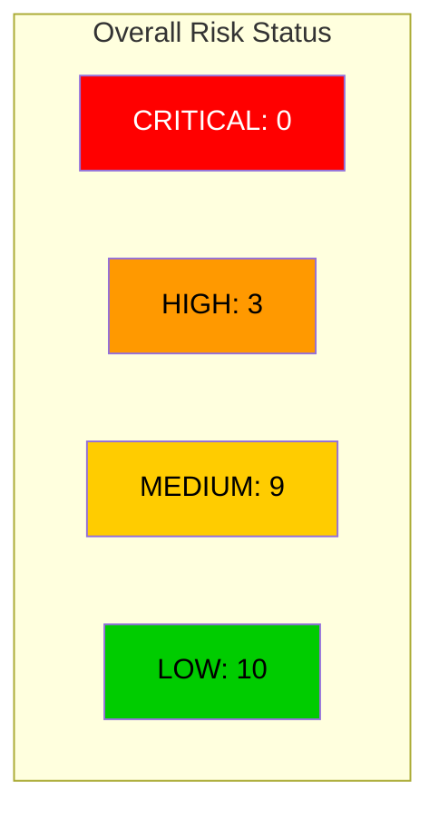
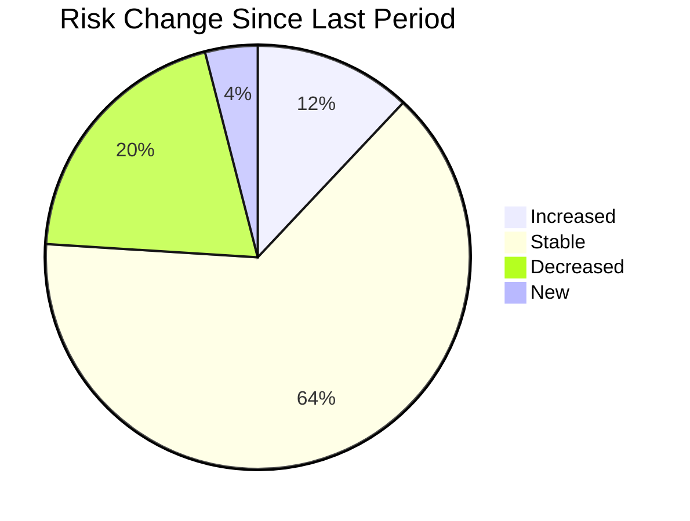
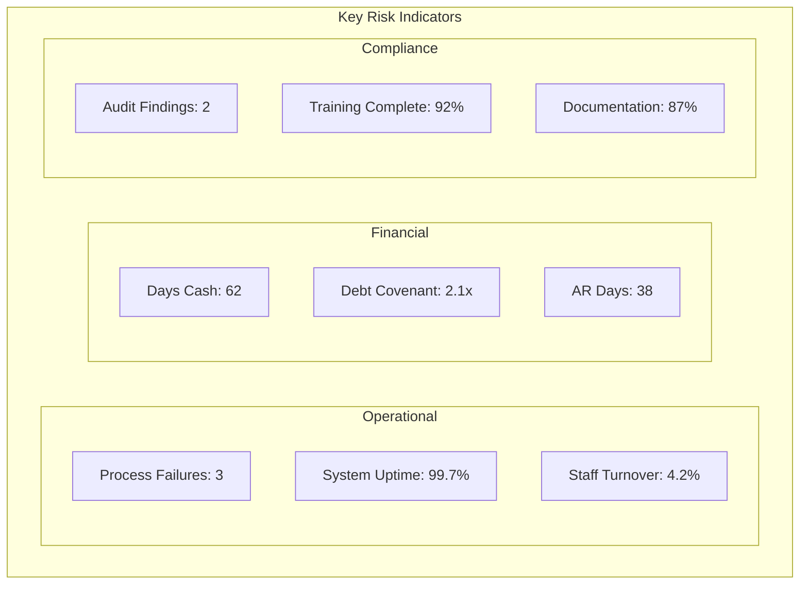
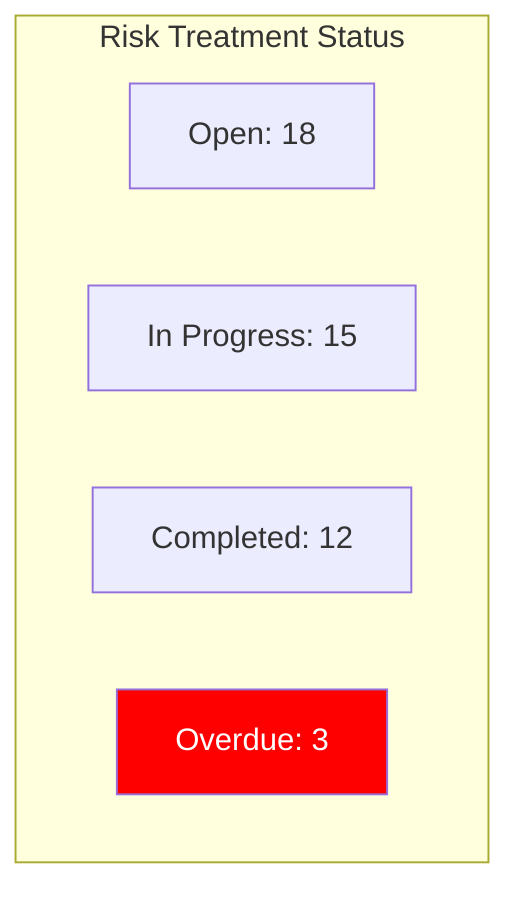

# Risk Dashboard - Weekly Summary

**Report Date**: June 1, 2023 | **Prepared By**: [[../README|Risk Management Unit]] | **Period**: May 25-31, 2023

## Executive Risk Summary

| Risk Category | Trend | Status | Key Concerns |
|---------------|-------|--------|--------------|
| Strategic | ↔️ | MEDIUM | Market competition, regulatory uncertainty |
| Financial | ↓ | MEDIUM | Liquidity pressure, foreign exchange volatility |
| Operational | ↑ | HIGH | Supply chain disruption, staffing shortages |
| Compliance | ↔️ | MEDIUM | New data protection regulations |
| Technology | ↓ | MEDIUM | Legacy system stability, cloud dependency |
| Reputational | ↔️ | LOW | Social media response capabilities |

## Risk Movement

## Top 5 Risks

| Rank | Risk ID | Description | Risk Level | Owner | Trend | Key Mitigation |
|------|---------|-------------|------------|-------|-------|----------------|
| 1 | HR-OPS-2023-05 | Supply Chain Disruption | HIGH | [[../../Operations/README|Supply Chain Manager]] | ↑ | Alternate supplier onboarding |
| 2 | HR-OPS-2023-04 | Legacy System Failure | HIGH | [[../../InformationTechnology/README|IT Director]] | ↔️ | System replacement project |
| 3 | HR-OPS-2023-02 | Staff Shortage | HIGH | [[../../CustomerSupport/README|CS Director]] | ↑ | Cross-training program |
| 4 | HR-FIN-2023-03 | Liquidity Risk | MEDIUM | [[../../Finance/README|Finance Director]] | ↓ | Credit facility expansion |
| 5 | HR-COM-2023-06 | Data Protection Compliance | MEDIUM | [[../../Compliance/README|Compliance Officer]] | ↑ | Regulatory readiness program |

## Key Risk Indicators

| KRI | Current | Threshold | Status | Trend | Owner |
|-----|---------|-----------|--------|-------|-------|
| Process Failures | 3 | <5 | ✅ | ↓ | [[../../Operations/README|Operations]] |
| System Uptime | 99.7% | >99.5% | ✅ | ↑ | [[../../InformationTechnology/README|IT]] |
| Staff Turnover | 4.2% | <5% | ✅ | ↑ | [[../../HumanResources/README|HR]] |
| Days Cash | 62 | >45 | ✅ | ↑ | [[../../Finance/README|Finance]] |
| Debt Covenant | 2.1x | >1.5x | ✅ | ↓ | [[../../Finance/README|Finance]] |
| AR Days | 38 | <45 | ✅ | ↔️ | [[../../Finance/README|Finance]] |
| Audit Findings | 2 | <3 | ✅ | ↓ | [[../../Compliance/README|Compliance]] |
| Training Complete | 92% | >90% | ✅ | ↑ | [[../../Compliance/README|Compliance]] |
| Documentation | 87% | >90% | ⚠️ | ↑ | All Units |

## Risk Response Activities

| Priority | Total | Completed | In Progress | Not Started | Overdue |
|----------|-------|-----------|-------------|-------------|---------|
| High | 12 | 4 | 5 | 0 | 3 |
| Medium | 18 | 7 | 8 | 3 | 0 |
| Low | 5 | 1 | 2 | 2 | 0 |

## Risk Incidents

**Total Incidents This Period**: 3

| Incident ID | Date | Category | Severity | Status | Business Impact | Owner |
|-------------|------|----------|----------|--------|----------------|-------|
| INC-2023-42 | May 29 | Operational | Medium | Resolved | 4 hour service disruption | [[../../Operations/README|Operations]] |
| INC-2023-43 | May 30 | Technology | Low | Resolved | Internal system delay | [[../../InformationTechnology/README|IT]] |
| INC-2023-44 | May 31 | Compliance | Medium | In Progress | Potential data exposure | [[../../Compliance/README|Compliance]] |

## New and Emerging Risks

| Risk ID | Description | Initial Rating | Key Concerns | Next Steps | Owner |
|---------|-------------|----------------|--------------|------------|-------|
| HR-NEW-2023-08 | AI Regulatory Changes | MEDIUM | Upcoming AI governance regulations may impact product development | Impact assessment | [[../../Compliance/README|Compliance]] |
| HR-EMG-2023-09 | Remote Work Security | MEDIUM | Increased security vulnerabilities from distributed workforce | Security assessment | [[../../Security/README|Security]] |

## Risk Acceptance Decisions

| Risk ID | Description | Risk Level | Rationale for Acceptance | Review Date | Approved By |
|---------|-------------|------------|--------------------------|-------------|-------------|
| HR-ACC-2023-06 | Legacy Application Support | MEDIUM | Cost of replacement exceeds risk impact; compensating controls in place | Sep 30, 2023 | IT Steering Committee |

## Cross-Functional Initiatives

| Initiative | Status | Units Involved | Next Milestone | Due Date |
|------------|--------|----------------|---------------|----------|
| Risk Control Automation | On Track | [[../README|Risk]], [[../../Operations/README|Operations]], [[../../InformationTechnology/README|IT]] | Requirements completion | Jun 15, 2023 |
| Operational Resilience | On Track | [[../README|Risk]], [[../../Operations/README|Operations]] | Tabletop exercise | Jul 15, 2023 |
| Data Governance | At Risk | [[../README|Risk]], [[../../Compliance/README|Compliance]], [[../../InformationTechnology/README|IT]] | Policy update | Jun 30, 2023 |

## Action Items This Week

| ID | Action | Owner | Due Date | Status |
|----|--------|-------|----------|--------|
| ACT-128 | Complete risk assessment for new product launch | Product Risk Team | Jun 5, 2023 | In Progress |
| ACT-129 | Submit updated BCP for executive review | [[../README|Business Continuity Lead]] | Jun 7, 2023 | Not Started |
| ACT-130 | Follow up on overdue high-priority mitigations | [[../README|Risk Manager]] | Jun 2, 2023 | In Progress |
| ACT-131 | Distribute updated risk appetite statement | [[../README|Risk Director]] | Jun 8, 2023 | Not Started |

## Appendices and Resources

- [Full Risk Register](#)
- [Risk Appetite Framework](../Policies/RiskAppetite.md)
- [Risk Assessment Methodology](../Processes/RiskAssessment.md)
- [Joint Operations-Risk Report](JointOperationsReport.md)

---

**Distribution**: Executive Committee, Risk Committee, Department Heads  
**Next Report**: June 8, 2023 