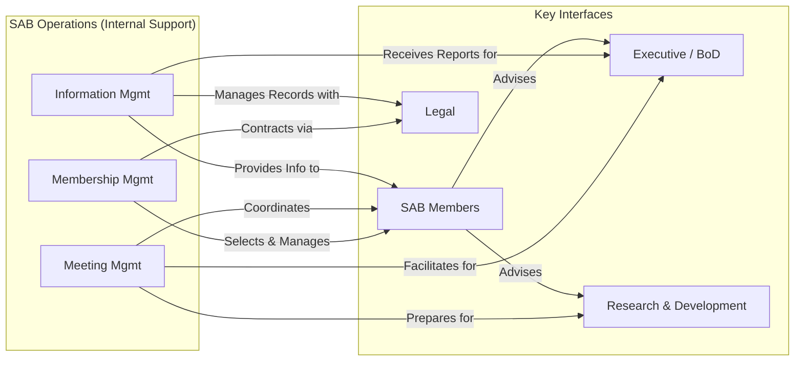

# Scientific Advisory Board (SAB) Unit

## Overview
The Scientific Advisory Board (SAB) serves as a critical external advisory body, composed of leading independent experts. It provides objective scientific and technical guidance to inform the organization's research and development strategy, evaluate programs, and foster innovation.

## Core Functions (Advisory)
- Strategic scientific direction review
- Research & Development (R&D) portfolio assessment
- Key project scientific evaluation
- Emerging technology and science monitoring
- Scientific risk identification
- Innovation opportunity scouting
- External scientific landscape analysis
- Mentorship/guidance to research teams (informal)

## Key Processes
1.  [[sab_member_selection_onboarding]]
2.  [[sab_meeting_planning_execution]]
3.  [[scientific_review_advisory_process]]
4.  [[strategic_topic_briefing_discussion]]
5.  [[sab_recommendation_reporting]]
6.  [[conflict_of_interest_management_sab]]

```mermaid
graph TD
    A[Org Identifies Need/Schedule] --> B(Plan SAB Meeting \n - Define Agenda & Objectives \n - Prepare Briefing Materials);
    B --> C(Select & Onboard Members \n [[sab_member_selection_onboarding]]);
    B --> D(Conduct Meeting \n [[sab_meeting_planning_execution]]);
    D --> E(Review Scientific Programs \n [[scientific_review_advisory_process]]);
    D --> F(Discuss Strategic Topics \n [[strategic_topic_briefing_discussion]]);
    E --> G{Generate Recommendations};
    F --> G;
    G --> H(Report Recommendations \n [[sab_recommendation_reporting]]);
    H --> I[Org Leadership Review & Action];
    C --> D;
    A --> C;
    H --> A; %% Cycle back for next meeting

    %% COI Management is Parallel
    P[COI Mgmt \n [[conflict_of_interest_management_sab]]] ---> D;
    P ---> E;
    P ---> F;
```

## Interfaces
### Internal Primary
- [[Executive]] / [[BoardOfDirectors]] - Receives strategic advice, provides direction
- [[ResearchDevelopment]] / [[Research]] / [[Development]] - Presents programs, receives feedback, provides data
- [[Strategy]] - Aligns SAB input with corporate strategy
- [[Innovation]] - Discusses emerging opportunities

### Internal Secondary
- [[Legal]] - Manages contracts, COI, IP considerations
- [[Compliance]] - Ensures adherence to regulations/ethics
- [[Finance]] - Provides context on resource allocation
- [[BusinessDevelopment]] - Provides market context, potential partnership insights

### External
- SAB Members (Leading Scientists, Clinicians, Technologists)
- Academic Institutions
- Research Organizations
- Regulatory Bodies (contextually)
- Industry Consortia

## Resources (Provided to SAB)
- [[sab_secure_portal]] (for documents, communication)
- Briefing Books / Pre-read Materials
- Meeting Agendas & Minutes
- Organizational Strategy Documents (relevant sections)
- R&D Portfolio Overview
- Specific Program Data & Presentations
- Access to relevant internal SMEs during meetings
- Administrative & Logistical Support

## Documentation
### Policies and Procedures
- [[sab_charter]]
- [[sab_operating_procedures]]
- [[sab_member_agreement_template]]
- [[conflict_of_interest_policy_sab]]
- [[confidentiality_policy_sab]]
- [[sab_meeting_process]]
- [[sab_reporting_guidelines]]

### Records
- [[sab_meeting_minutes]]
- [[sab_recommendation_reports]]
- [[sab_member_coi_disclosures]]
- [[sab_member_profiles]]

## SAB Operations
1.  **Membership Management:**
    - [[member_identification_recruitment]]
    - [[member_vetting_selection]]
    - [[contracting_onboarding]]
    - [[coi_disclosure_management]]
    - [[term_management_renewal]]
2.  **Meeting Management:**
    - [[agenda_setting_collaboration]] (with internal leadership)
    - [[briefing_material_preparation_distribution]]
    - [[logistics_coordination]] (travel, venue/virtual platform)
    - [[meeting_facilitation]]
    - [[minute_taking_distribution]]
3.  **Information Management:**
    - [[secure_document_management]]
    - [[communication_channel_management]]
    - [[recommendation_tracking_internal_reporting]]



## Performance Metrics (Internal Process)
- Timeliness of meeting material distribution
- SAB member engagement/participation rates
- Quality/clarity of meeting minutes and recommendation reports
- Turnaround time for internal review of SAB recommendations
- Adherence to COI and confidentiality policies
- Feedback from SAB members on meeting effectiveness
- Feedback from internal stakeholders on the value of SAB input

## Strategic Management
- Aligning SAB expertise with evolving strategic R&D needs
- Periodically reviewing SAB charter and effectiveness
- Ensuring diversity of thought and expertise on the Board
- Managing SAB budget and resources effectively

## Related Links
- [[sab_secure_portal]]
- [[research_development_roadmap]]
- [[corporate_strategy_overview]]
- [[innovation_pipeline_summary]]

## Focus Areas (Example)
- [[emerging_technology_assessment]]
- [[therapeutic_area_strategy_review]]
- [[clinical_development_plan_evaluation]]
- [[preclinical_portfolio_assessment]]
- [[data_science_ai_strategy_guidance]]
- [[manufacturing_technology_scalability_review]]

---
Last Updated: YYYY-MM-DD
Version: 1.0
Maintained by: [[Office of the CTO/CSO or Designated Liaison]]
Security Level: [[highly_confidential]]
Document Status: [[active]] 