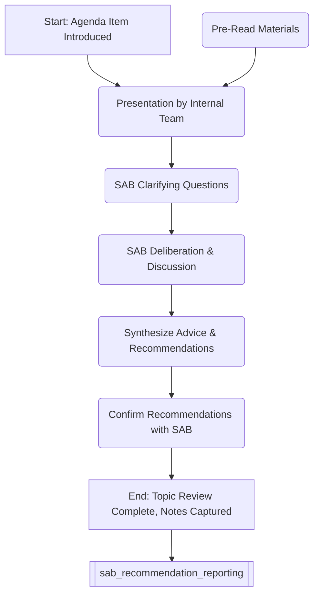

# Scientific Review & Advisory Process (within SAB Meeting)

## Overview
This process describes how specific scientific programs, projects, or technical topics are presented to the Scientific Advisory Board (SAB) during a meeting ([[sab_meeting_planning_execution]]) and how the SAB provides its expert review and advice.

## Process Steps (Occurs during SAB Meeting)

1.  **Topic Introduction:**
    *   Meeting Facilitator/Chair introduces the agenda item, presenter(s), and the specific objectives for the review (e.g., evaluate scientific rationale, assess technical feasibility, review interim data, advise on next steps).
    *   Presenter briefly sets the context and scope.
2.  **Presentation:**
    *   Designated internal expert(s) from [[ResearchDevelopment]] or other relevant units present the topic based on the pre-read materials.
    *   Presentation focuses on key data, methodologies, results (if any), challenges, and specific questions posed to the SAB.
    *   Adherence to allocated time is critical.
3.  **Clarifying Questions:**
    *   SAB members ask questions to ensure clear understanding of the presented information, data, and context.
    *   Presenters provide concise and direct answers.
4.  **SAB Deliberation & Discussion:**
    *   Facilitator/Chair opens the floor for SAB discussion.
    *   Members share their expert perspectives, critique the scientific approach, interpret data, challenge assumptions, and compare with external benchmarks or knowledge.
    *   Discussion focuses on addressing the specific questions posed and providing constructive feedback.
    *   Internal participants primarily listen, answering direct questions but generally not participating in the advisory deliberation unless invited.
5.  **Synthesize Advice & Recommendations:**
    *   Facilitator/Chair helps guide the discussion towards consensus where possible or clearly articulates divergent viewpoints.
    *   Key points of advice, specific recommendations (e.g., experiments to conduct, alternative approaches, go/no-go suggestions), and rationale are summarized verbally.
    *   Designated scribe captures these points accurately (feeding into [[sab_recommendation_reporting]]).
6.  **Confirmation & Wrap-up:**
    *   Facilitator/Chair confirms the captured recommendations with the SAB members to ensure accuracy.
    *   Presenter briefly acknowledges the feedback.
    *   Transition to the next agenda item.

## Process Flow Diagram (Conceptual within Meeting Context)

## Roles & Responsibilities
*   **Presenter (Internal SME):** Delivers clear, concise presentation; answers clarifying questions.
*   **SAB Members:** Actively listen, ask critical questions, provide expert scientific/technical critique and advice.
*   **Facilitator/Chair:** Manages time, guides discussion, ensures focus on objectives, synthesizes recommendations.
*   **SAB Liaison / Management:** Ensures smooth process flow, supports facilitator.
*   **Designated Scribe:** Accurately captures key discussion points and recommendations.
*   **Other Internal Participants:** Primarily observe and listen; answer specific questions if required.

## Related Documents & Policies
*   [[sab_meeting_planning_execution]] (Context)
*   [[sab_operating_procedures]]
*   [[confidentiality_policy_sab]]
*   Briefing Materials (Input)
*   [[sab_recommendation_reporting]] (Output)

---
Version: 1.0
Last Updated: YYYY-MM-DD
Owner: [[Office of the CTO/CSO or Designated Liaison]] 