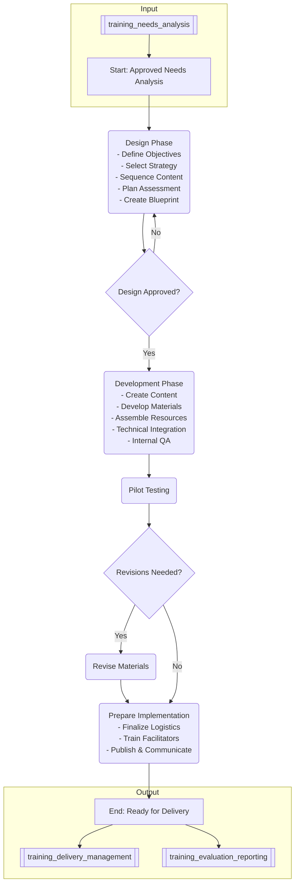

# Instructional Design & Development Process

## Overview
This process describes the systematic approach used by the Training & Development unit to design, develop, and maintain effective and engaging learning experiences, based on the outputs of the [[training_needs_analysis]] process.

## Process Steps (Aligned with ADDIE Model)

1.  **Analysis (Input):**
    *   Receive approved [[training_needs_analysis]] report.
    *   Review target audience characteristics, learning objectives, constraints (budget, timeline, technology), and desired performance outcomes.
2.  **Design:**
    *   **Define Learning Objectives:** Refine or confirm specific, measurable, achievable, relevant, and time-bound (SMART) learning objectives.
    *   **Select Instructional Strategy:** Determine the most appropriate instructional methods (e.g., lecture, case study, simulation, group work, eLearning modules) and media based on objectives, audience, and context.
    *   **Sequence Content:** Organize content logically and create a high-level course outline or curriculum map.
    *   **Develop Assessment Strategy:** Plan how learning will be measured (e.g., quizzes, projects, observations, tests) aligned with objectives (formative and summative).
    *   **Create Design Document/Blueprint:** Document the design plan, including objectives, strategy, outline, assessment plan, and technical specifications.
    *   **Stakeholder Review:** Obtain feedback and approval on the design document.
3.  **Development:**
    *   **Create Content:** Write scripts, develop presentations, create job aids, record audio/video, source or create graphics.
    *   **Develop Materials:** Build eLearning modules using [[content_authoring_tools]], create facilitator/participant guides, develop assessment instruments.
    *   **Assemble Learning Resources:** Gather or link to supplementary materials.
    *   **Technical Integration:** Configure materials within the [[learning_management_system]] or other delivery platforms.
    *   **Internal Review & QA:** Conduct thorough reviews for accuracy, clarity, completeness, functionality, and adherence to [[instructional_design_standards]].
4.  **Implementation (Preparation):**
    *   **Pilot Testing:** Conduct a pilot session with a representative sample of the target audience to gather feedback and identify necessary revisions.
    *   **Revise Materials:** Make necessary adjustments based on pilot feedback.
    *   **Prepare Facilitators/Trainers:** Conduct [[train_the_trainer]] sessions if applicable.
    *   **Finalize Logistics:** Confirm schedules, locations (if physical), technology setup.
    *   **Publish & Communicate:** Upload final materials to LMS, communicate availability and schedule to learners and managers (leading into [[training_delivery_management]]).
5.  **Evaluation (Ongoing & Post-Delivery):**
    *   Monitor formative assessment results during delivery.
    *   Administer summative assessments post-training.
    *   Gather feedback via surveys (linking to [[training_evaluation_reporting]]).
    *   Review materials periodically for relevance and accuracy.
    *   Use evaluation data to inform future revisions (continuous improvement loop).

## Process Flow Diagram

## Roles & Responsibilities
*   **Instructional Designer:** Leads the design and development process, creates design documents, develops materials, conducts reviews.
*   **Subject Matter Expert (SME):** Provides content expertise, reviews materials for accuracy.
*   **Training & Development Manager:** Oversees the process, allocates resources, approves design documents, manages stakeholders.
*   **Graphic Designer/Multimedia Developer:** Creates visual assets, develops interactive elements (if applicable).
*   **LMS Administrator:** Configures courses in the LMS, manages technical aspects.
*   **Facilitators/Trainers:** Provide input during design, participate in pilot testing and train-the-trainer sessions.
*   **Stakeholders:** Provide feedback during design reviews and pilot testing.

## Related Documents & Policies
*   [[training_needs_analysis]] (Input)
*   [[instructional_design_standards]]
*   [[content_development_policy]]
*   [[competency_framework]]
*   [[learning_management_system]]
*   [[content_authoring_tools]]
*   [[evaluation_model]] (e.g., Kirkpatrick)
*   [[training_evaluation_reporting]] (Output/Feedback Loop)
*   [[training_delivery_management]] (Output)

---
Version: 1.0
Last Updated: YYYY-MM-DD
Owner: [[training_development_director]] 