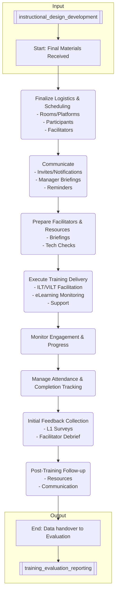

# Training Delivery Management Process

## Overview
This process covers the planning, coordination, execution, and monitoring of training delivery across various modalities (Instructor-Led Training (ILT), Virtual Instructor-Led Training (VILT), eLearning, Blended) following the [[instructional_design_development]] phase.

## Process Steps

1.  **Receive Finalized Training Plan/Materials:** Obtain approved materials, schedules, target audience lists, and logistical requirements from the [[instructional_design_development]] process.
2.  **Finalize Logistics & Scheduling:**
    *   **ILT:** Confirm room bookings, AV equipment, catering (if applicable), material printing/distribution.
    *   **VILT:** Schedule sessions on [[virtual_classroom_platform]], confirm facilitator/participant tech requirements, distribute pre-session materials/links.
    *   **eLearning:** Confirm course availability and enrollment procedures in the [[learning_management_system]].
    *   **General:** Finalize participant lists, confirm facilitator assignments.
3.  **Communicate with Participants & Managers:**
    *   Send out calendar invites/enrollment notifications with clear instructions (pre-work, objectives, schedule, location/link).
    *   Inform managers about their team members' participation and any expected manager involvement.
    *   Send reminders leading up to the training.
4.  **Prepare Facilitators & Resources:**
    *   Ensure facilitators have final guides, materials, and access to necessary platforms/tools.
    *   Conduct final briefing/tech check sessions for facilitators.
    *   Ensure support resources (IT, room setup) are confirmed.
5.  **Execute Training Delivery:**
    *   **ILT/VILT:** Facilitator delivers content, manages activities, encourages participation, addresses questions, collects attendance.
    *   **eLearning:** Monitor learner progress and completion rates via LMS.
    *   Provide technical or logistical support to learners and facilitators as needed.
6.  **Monitor Engagement & Progress:**
    *   **ILT/VILT:** Facilitators observe participation levels and understanding.
    *   **eLearning:** Track progress, identify learners falling behind.
    *   Collect immediate feedback (e.g., end-of-session polls, informal checks).
7.  **Manage Attendance & Completion:**
    *   Record attendance accurately for ILT/VILT.
    *   Track completion status in the LMS for eLearning and blended programs.
    *   Follow up with non-attendees or those with incomplete status as per policy.
8.  **Initial Feedback Collection:**
    *   Distribute immediate reaction/Level 1 feedback surveys (e.g., end-of-course surveys).
    *   Facilitators provide debrief notes on session delivery.
9.  **Post-Training Follow-up:**
    *   Distribute any post-training resources or job aids.
    *   Communicate completion status to relevant stakeholders (managers, HR).
    *   Transition data (attendance, initial feedback) to the [[training_evaluation_reporting]] process.

## Process Flow Diagram

## Roles & Responsibilities
*   **Training Coordinator/Specialist:** Manages logistics, scheduling, communication, participant tracking, LMS administration for delivery.
*   **Facilitator/Trainer:** Delivers ILT/VILT sessions, manages classroom/virtual environment, provides initial feedback.
*   **LMS Administrator:** Ensures eLearning courses are correctly deployed and tracked.
*   **Instructional Designer:** May provide support during delivery, clarifies content questions.
*   **IT Support:** Provides technical assistance for platforms and equipment.
*   **Participants:** Attend/complete training, provide feedback.
*   **Managers:** Ensure participants attend/complete training, support application of learning.

## Related Documents & Policies
*   [[instructional_design_development]] (Input)
*   [[training_delivery_guidelines]]
*   [[lms_usage_policy]]
*   [[facilitator_guide]]
*   [[participant_guide]]
*   [[virtual_classroom_platform]]
*   [[learning_management_system]]
*   [[training_evaluation_reporting]] (Output)

---
Version: 1.0
Last Updated: YYYY-MM-DD
Owner: [[training_development_director]] 