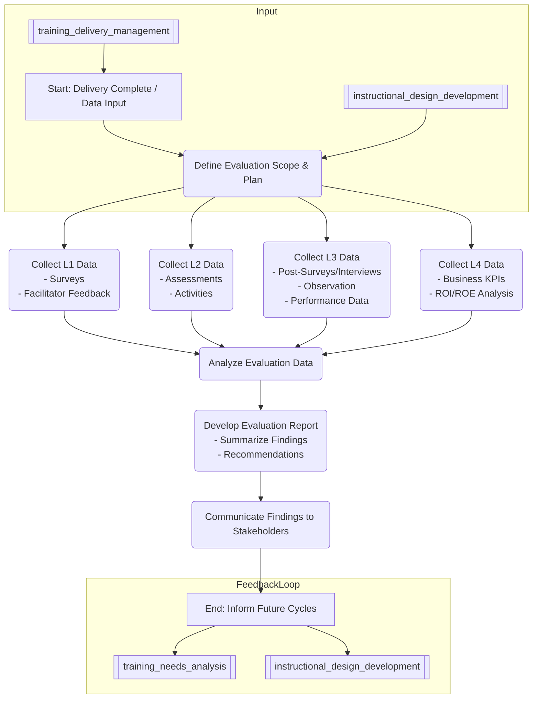

# Training Evaluation & Reporting Process

## Overview
This process defines the methodology for evaluating the effectiveness of training programs and reporting the findings to stakeholders. It utilizes data gathered during and after the [[training_delivery_management]] process to measure impact and inform continuous improvement.

## Process Steps (Aligned with Kirkpatrick Model)

1.  **Define Evaluation Scope & Plan:**
    *   Based on the program's objectives from [[instructional_design_development]], determine the levels of evaluation (1-4) required.
    *   Identify key metrics for each level.
    *   Select appropriate data collection methods and tools (surveys, assessments, interviews, performance data analysis).
    *   Establish timeline for data collection and reporting.
2.  **Collect Level 1 Data (Reaction):**
    *   Administer satisfaction surveys immediately post-training (via LMS or survey tool).
    *   Gather facilitator feedback on session dynamics and participant engagement.
    *   Collect qualitative comments on relevance, materials, facilitator, and logistics.
3.  **Collect Level 2 Data (Learning):**
    *   Administer pre/post-knowledge assessments or skill tests.
    *   Review in-training activities, simulations, or projects designed to measure understanding.
    *   Use scoring rubrics for evaluated exercises.
4.  **Collect Level 3 Data (Behavior):** (Often requires time delay)
    *   Conduct post-training surveys or interviews with participants and/or their managers (e.g., 30-60-90 days post-training).
    *   Use behavioral observation checklists (by managers or peers).
    *   Review performance appraisal data related to the trained skills/behaviors.
    *   Analyze work samples or project outputs.
5.  **Collect Level 4 Data (Results):** (Most complex, requires alignment with business KPIs)
    *   Analyze relevant business metrics pre- and post-training (e.g., sales figures, error rates, productivity metrics, customer satisfaction, employee retention in the target group).
    *   Correlate training participation with changes in KPIs (requires careful analysis to isolate training impact).
    *   Calculate Return on Investment (ROI) or Return on Expectations (ROE) where feasible and appropriate.
6.  **Analyze Evaluation Data:**
    *   Compile data from all collected levels.
    *   Perform quantitative analysis (e.g., average scores, completion rates, score improvements).
    *   Perform qualitative analysis (e.g., identify common themes in comments).
    *   Compare results against initial objectives and benchmarks.
7.  **Develop Evaluation Report:**
    *   Summarize findings for each evaluation level.
    *   Highlight key successes and areas for improvement.
    *   Draw conclusions about the training's effectiveness and impact.
    *   Provide actionable recommendations for program revision (feeding back to [[instructional_design_development]]), future initiatives, or non-training interventions.
    *   Tailor reports for different stakeholder audiences (e.g., executive summary, detailed analysis).
8.  **Communicate Findings:**
    *   Present reports to key stakeholders (program sponsors, managers, HR, Training & Development team).
    *   Store reports in a central repository (e.g., [[Reports]] folder).
    *   Use findings to inform the next cycle of [[training_needs_analysis]] and program design.

## Process Flow Diagram

## Roles & Responsibilities
*   **Training Analyst/Specialist:** Designs evaluation plan, develops instruments, collects/analyzes data, writes reports.
*   **LMS Administrator:** Pulls reports on completion, assessment scores, survey data from [[learning_management_system]].
*   **Instructional Designer:** Provides input on objectives and assessment alignment, receives feedback for revisions.
*   **Training & Development Manager:** Oversees evaluation strategy, reviews reports, communicates findings to leadership.
*   **Facilitators:** Provide Level 1 feedback and insights.
*   **Managers:** May provide Level 3 data (observation, performance data), receive reports on team impact.
*   **Participants:** Complete surveys and assessments.
*   **Data Analysts (Potentially from other Units):** May assist with Level 4 data collection and correlation analysis.

## Related Documents & Policies
*   [[training_delivery_management]] (Input)
*   [[instructional_design_development]] (Input for objectives)
*   [[evaluation_methodology]]
*   [[evaluation_model]] (e.g., Kirkpatrick)
*   [[survey_feedback_tools]]
*   [[learning_management_system]]
*   [[analytics_dashboard]]
*   [[training_needs_analysis]] (Feedback Loop)

---
Version: 1.0
Last Updated: YYYY-MM-DD
Owner: [[training_development_director]] 