# Organization Unit Directory

## Overview
This directory serves as the central source of truth for all organizational units within the [[organization]]. Each unit is carefully structured to maintain clear responsibilities, hierarchies, and cross-functional relationships, ensuring effective coordination and alignment across the organization.

## 📊 Organizational Architecture

### High-Level Organizational Structure
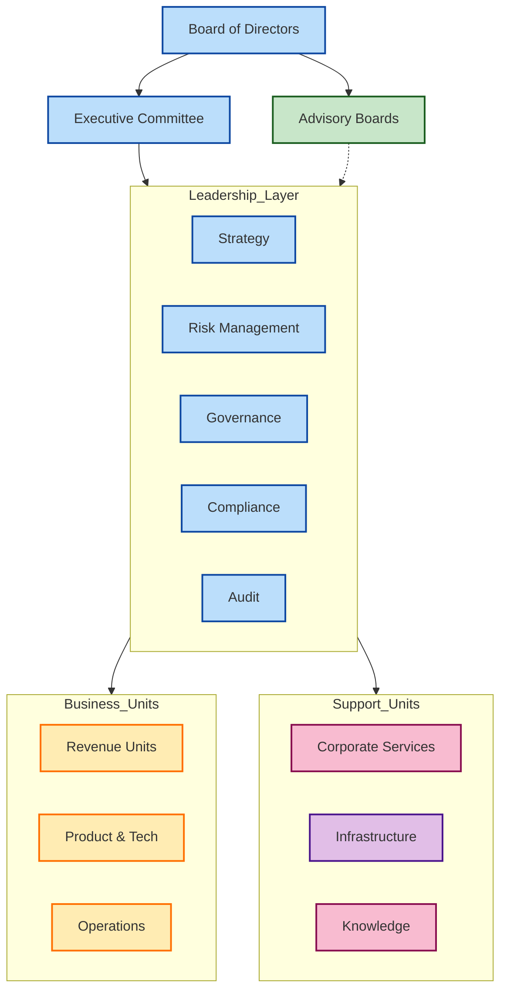

### Detailed Organizational Relationships
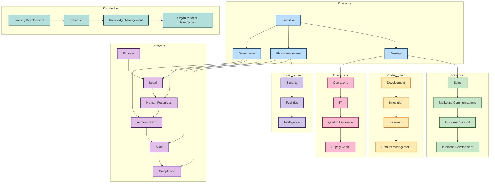

### 📈 Decision Flow Architecture
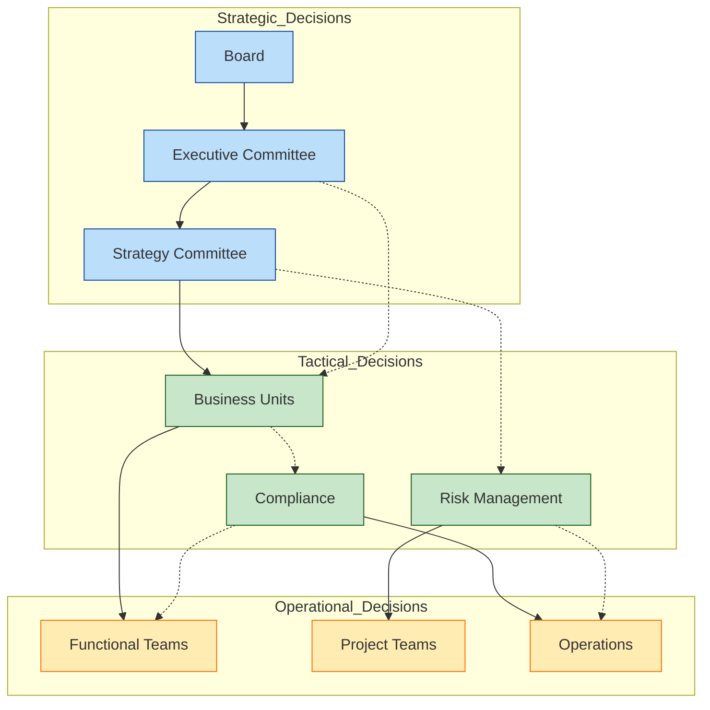

### 🔄 Information Flow Architecture 
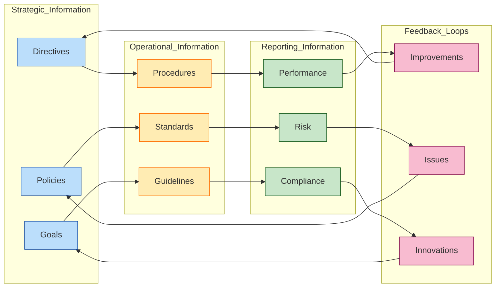

## Unit Structure
Each unit follows a standardized structure:
- Unit Overview
- Core Responsibilities
- Key Processes
- Interfaces (Internal Primary, Internal Secondary, External)
- Resources (Systems and Tools)
- Documentation (Policies, Procedures, and Frameworks)
- Operational Areas
- Operational Functions
- Performance Metrics
- Strategic Management
- Related Links
- Strategic Initiatives
- Innovation Projects
- Risk Management
- Programs (Core and Support)

### 📋 Unit Architecture Framework
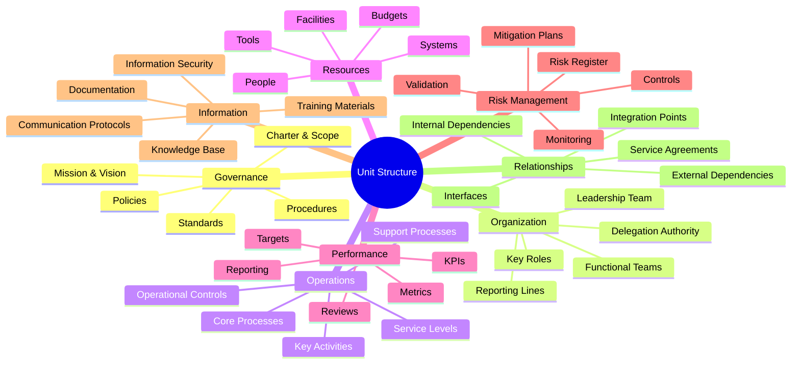

## Organizational Structure

### Executive Leadership
#### Board Structure
- [[units/BoardOfDirectors/board_of_directors_unit|Board of Directors]] - Corporate oversight and governance
- [[units/ExecutiveCommittee/executive_committee_unit|Executive Committee]] - Executive leadership and execution
- [[units/AdvisoryBoard/advisory_board_unit|Advisory Board]] - Strategic guidance and expertise
- [[Strategic_Council]] - Strategic direction and alignment

#### Advisory Structure
- [[units/ScientificAdvisoryBoard/scientific_advisory_board_unit|Scientific Advisory Board]] - Scientific and technical guidance
- [[units/TechnologyAdvisoryBoard/technology_advisory_board_unit|Technology Advisory Board]] - Technology strategy and innovation
- [[units/EthicsAdvisoryBoard/ethics_advisory_board_unit|Ethics Advisory Board]] - Ethics and integrity guidance
- [[units/RiskAdvisoryBoard/risk_advisory_board_unit|Risk Advisory Board]] - Risk and resilience guidance

#### Executive Functions
- [[units/Strategy/strategy_unit|Strategy]] - Strategic direction and execution
- [[units/Governance/governance_unit|Governance]] - Corporate governance and oversight
- [[units/RiskManagement/risk_management_unit|Risk Management]] - Enterprise risk and resilience
- [[units/Compliance/compliance_unit|Compliance]] - Regulatory adherence and ethics
- [[units/Audit/audit_unit|Audit]] - Organizational assurance and control
- [[units/Executive/executive_unit|Executive]] - Executive leadership and management

#### Leadership Committees
##### Oversight Committees
1. [[Audit_Committee]]
   - Financial oversight
   - Control assessment
   - Risk evaluation
   - Compliance review
   - Performance validation
   - Process verification
   - Future planning
   - Strategic oversight

2. [[Risk_Committee]]
   - Risk oversight
   - Threat assessment
   - Control evaluation
   - Resilience review
   - Crisis management
   - Continuity planning
   - Future risks
   - Strategic oversight

3. [[Compliance_Committee]]
   - Compliance oversight
   - Regulatory assessment
   - Policy evaluation
   - Ethics review
   - Standards management
   - Control validation
   - Future planning
   - Strategic oversight

4. [[Governance_Committee]]
   - Governance oversight
   - Policy assessment
   - Decision evaluation
   - Structure review
   - Process management
   - Framework validation
   - Future planning
   - Strategic oversight

##### Strategic Committees
1. [[Strategy_Committee]]
   - Strategy oversight
   - Market assessment
   - Growth evaluation
   - Innovation review
   - Performance management
   - Value creation
   - Future planning
   - Strategic oversight

2. [[Innovation_Committee]]
   - Innovation oversight
   - Technology assessment
   - Process evaluation
   - Product review
   - Service management
   - Performance validation
   - Future planning
   - Strategic oversight

3. [[Ethics_Committee]]
   - Ethics oversight
   - Integrity assessment
   - Values evaluation
   - Culture review
   - Compliance management
   - Standards validation
   - Future planning
   - Strategic oversight

### 🔄 Committee Relationships Matrix

| Committee | Primary Inputs | Key Outputs | Strategic Impact |
|-----------|---------------|-------------|------------------|
| **Audit Committee** | Financial Statements, Control Reports, Audit Results | Assurance Reports, Control Recommendations | Organizational Integrity |
| **Risk Committee** | Risk Assessments, Incident Reports, Threat Analysis | Risk Mitigation Strategies, Resilience Plans | Organizational Resilience |
| **Compliance Committee** | Regulatory Updates, Policy Adherence Reports | Policy Updates, Compliance Program Enhancements | Regulatory Alignment |
| **Governance Committee** | Governance Best Practices, Framework Assessments | Governance Structure Updates, Decision Framework Improvements | Governance Effectiveness |
| **Strategy Committee** | Market Analysis, Competitive Intelligence | Strategic Direction, Growth Initiatives | Organizational Direction |
| **Innovation Committee** | Technology Trends, Innovation Opportunities | Innovation Roadmap, Transformation Initiatives | Future Relevance |
| **Ethics Committee** | Culture Assessments, Ethics Concerns | Ethics Framework Updates, Cultural Initiatives | Organizational Integrity |

### Committee Relationships
#### Primary Interfaces
1. Oversight Integration
   - [[Audit_Committee]] ↔ [[Risk_Committee]]
   - [[Risk_Committee]] ↔ [[Compliance_Committee]]
   - [[Compliance_Committee]] ↔ [[Governance_Committee]]
   - [[Governance_Committee]] ↔ [[Ethics_Committee]]

2. Strategic Integration
   - [[Strategy_Committee]] ↔ [[Innovation_Committee]]
   - [[Innovation_Committee]] ↔ [[Ethics_Committee]]
   - [[Ethics_Committee]] ↔ [[Compliance_Committee]]
   - [[Strategy_Committee]] ↔ [[Governance_Committee]]

#### 🔄 Committee Interface Diagram
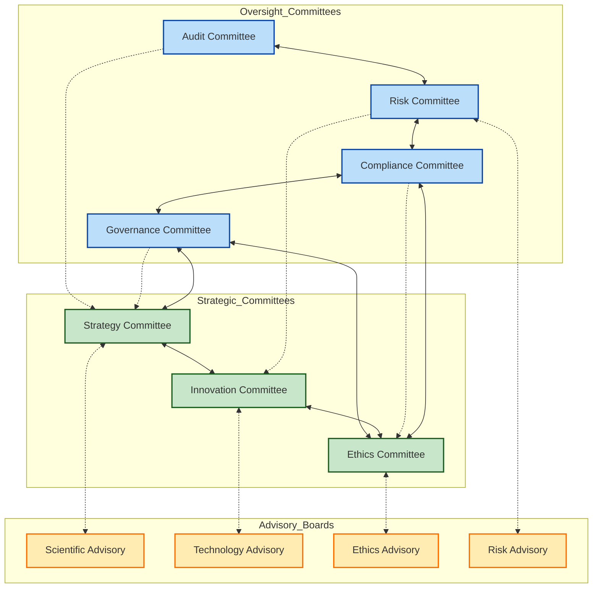

#### Secondary Interfaces
1. Cross-functional Coordination
   - [[Audit_Committee]] → [[Strategy_Committee]]
   - [[Risk_Committee]] → [[Innovation_Committee]]
   - [[Compliance_Committee]] → [[Ethics_Committee]]
   - [[Governance_Committee]] → [[Strategy_Committee]]

2. Advisory Relationships
   - [[Strategy_Committee]] → [[Scientific_Advisory_Board]]
   - [[Innovation_Committee]] → [[Technology_Advisory_Board]]
   - [[Ethics_Committee]] → [[Ethics_Advisory_Board]]
   - [[Risk_Committee]] → [[Risk_Advisory_Board]]

### Committee Resources
#### Management Systems
1. Oversight Systems
   - [[audit_management_system]]
   - [[risk_management_system]]
   - [[compliance_management_system]]
   - [[governance_management_system]]

2. Strategic Systems
   - [[strategy_management_system]]
   - [[innovation_management_system]]
   - [[ethics_management_system]]
   - [[performance_management_system]]

#### Support Resources
1. Operational Centers
   - [[audit_center]]
   - [[risk_center]]
   - [[compliance_center]]
   - [[governance_center]]
   - [[strategy_center]]
   - [[innovation_center]]
   - [[ethics_center]]
   - [[performance_center]]

2. Knowledge Hubs
   - [[audit_hub]]
   - [[risk_hub]]
   - [[compliance_hub]]
   - [[governance_hub]]
   - [[strategy_hub]]
   - [[innovation_hub]]
   - [[ethics_hub]]
   - [[performance_hub]]

### 🛠️ Committee Systems Architecture
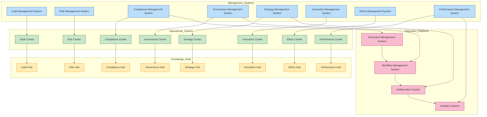

### Committee Documentation
#### Core Documentation
1. Governance Documents
   - [[committee_charters]]
   - [[governance_frameworks]]
   - [[oversight_policies]]
   - [[strategic_policies]]

2. Operational Documents
   - [[meeting_protocols]]
   - [[reporting_standards]]
   - [[assessment_frameworks]]
   - [[performance_metrics]]

#### Support Documentation
1. Process Documents
   - [[workflow_procedures]]
   - [[integration_guidelines]]
   - [[coordination_protocols]]
   - [[communication_standards]]

2. Reference Documents
   - [[best_practices]]
   - [[knowledge_base]]
   - [[resource_library]]
   - [[training_materials]]

### 📊 Documentation Reference Architecture
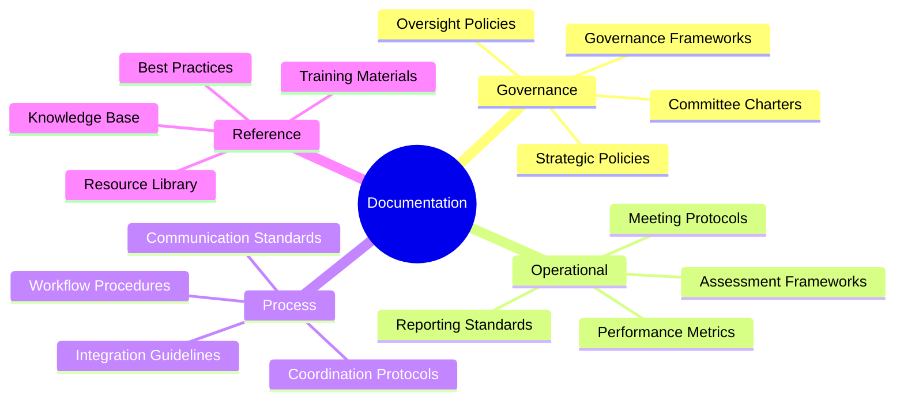

### Business Units
1. Revenue Generation
   - [[units/Sales/sales_unit|Sales]] - Revenue growth and market expansion
   - [[units/Marketing/marketing_unit|Marketing]] - Brand building and market positioning
   - [[units/MarketingCommunications/marketing_communications_unit|Marketing Communications]] - Communications and market presence
   - [[units/CustomerSupport/customer_support_unit|Customer Support]] - Customer success and service
   - [[units/BusinessDevelopment/business_development_unit|Business Development]] - Strategic partnerships and growth

2. Product and Technology
   - [[units/Development/development_unit|Development]] - Product and technology development
   - [[units/Innovation/innovation_unit|Innovation]] - Innovation and transformation
   - [[units/Research/research_unit|Research]] - Research and advancement
   - [[units/ResearchDevelopment/research_development_unit|Research Development]] - Applied research and development
   - [[units/ProductManagement/product_management_unit|Product Management]] - Product strategy and lifecycle

3. Operations and Support
   - [[units/Operations/operations_unit|Operations]] - Operational excellence
   - [[units/InformationTechnology/it_unit|IT]] - Technology infrastructure
   - [[units/QualityAssurance/quality_assurance_unit|Quality Assurance]] - Quality and standards
   - [[units/SupplyChain/supply_chain_unit|Supply Chain]] - Supply chain optimization

4. Corporate Services
   - [[units/Finance/finance_unit|Finance]] - Financial management
   - [[units/Legal/legal_unit|Legal]] - Legal and compliance
   - [[units/HumanResources/human_resources_unit|Human Resources]] - People and culture
   - [[units/Administration/administration_unit|Administration]] - Administrative support
   - [[units/Audit/audit_unit|Audit]] - Organizational assurance
   - [[units/Compliance/compliance_unit|Compliance]] - Regulatory adherence
   - [[units/Executive/executive_unit|Executive]] - Executive leadership

5. Infrastructure and Security
   - [[units/Security/security_unit|Security]] - Comprehensive security
   - [[units/Facilities/facilities_unit|Facilities]] - Facility management
   - [[units/Intelligence/intelligence_unit|Intelligence]] - Strategic intelligence
   - [[units/RiskManagement/risk_management_unit|Risk Management]] - Risk and resilience

6. Knowledge and Development
   - [[units/TrainingDevelopment/training_development_unit|Training Development]] - Professional development
   - [[units/Education/education_unit|Education]] - Educational programs
   - [[units/KnowledgeManagement/knowledge_management_unit|Knowledge Management]] - Knowledge and learning
   - [[units/OrganizationalDevelopment/organizational_development_unit|Organizational Development]] - Organizational effectiveness

### 📈 Business Unit Interaction Matrix
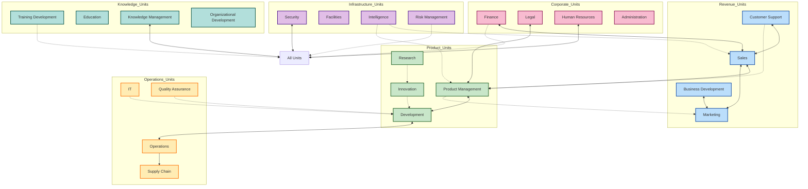

### Business Unit Relationships
#### Primary Interfaces
1. Revenue Units
   - [[units/Sales/sales_unit|Sales]] ↔ [[units/Marketing/marketing_unit|Marketing]]
   - [[units/Marketing/marketing_unit|Marketing]] ↔ [[units/CustomerSupport/customer_support_unit|Customer Support]]
   - [[units/CustomerSupport/customer_support_unit|Customer Support]] ↔ [[units/BusinessDevelopment/business_development_unit|Business Development]]

2. Product Units
   - [[units/Development/development_unit|Development]] ↔ [[units/Innovation/innovation_unit|Innovation]]
   - [[units/Innovation/innovation_unit|Innovation]] ↔ [[units/Research/research_unit|Research]]
   - [[units/Research/research_unit|Research]] ↔ [[units/ProductManagement/product_management_unit|Product Management]]

3. Operations Units
   - [[units/Operations/operations_unit|Operations]] ↔ [[units/InformationTechnology/it_unit|IT]]
   - [[units/InformationTechnology/it_unit|IT]] ↔ [[units/QualityAssurance/quality_assurance_unit|Quality Assurance]]
   - [[units/QualityAssurance/quality_assurance_unit|Quality Assurance]] ↔ [[units/SupplyChain/supply_chain_unit|Supply Chain]]

## Core Units

### [[units/Strategy/strategy_unit|Strategy]]
- Strategic planning
- Market analysis
- Competitive intelligence
- Strategic execution
- Portfolio management
- Growth strategy
- Innovation direction
- Strategic alignment
- Value creation
- Performance oversight

### 🔄 Strategy Process Architecture
```mermaid
stateDiagram-v2
    [*] --> Vision
    
    Vision --> Analysis
    
    state Analysis {
        [*] --> Market
        Market --> Competition
        Competition --> Capabilities
        Capabilities --> [*]
    }
    
    Analysis --> Planning
    
    state Planning {
        [*] --> Objectives
        Objectives --> Initiatives
        Initiatives --> Resources
        Resources --> Metrics
        Metrics --> [*]
    }
    
    Planning --> Execution
    
    state Execution {
        [*] --> Implementation
        Implementation --> Monitoring
        Monitoring --> Adjustment
        Adjustment --> [*]
    }
    
    Execution --> Review
    
    state Review {
        [*] --> Performance
        Performance --> Lessons
        Lessons --> Feedback
        Feedback --> [*]
    }
    
    Review --> [*]
```

### [[units/RiskManagement/risk_management_unit|Risk Management]]
- Risk strategy
- Risk assessment
- Risk mitigation
- Risk monitoring
- Compliance management
- Control framework
- Crisis management
- Business continuity
- Risk reporting
- Governance oversight

### 🛡️ Risk Management Framework
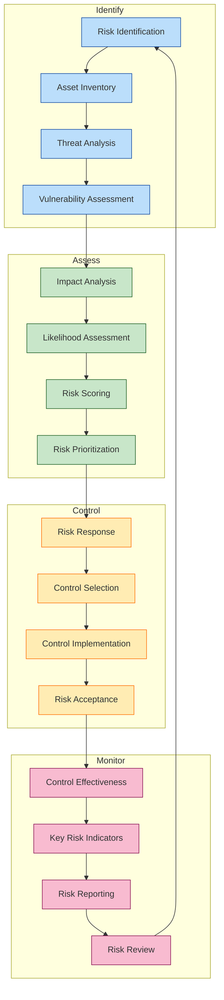

## 🔗 Unit Interaction Models

### Primary Interaction Patterns
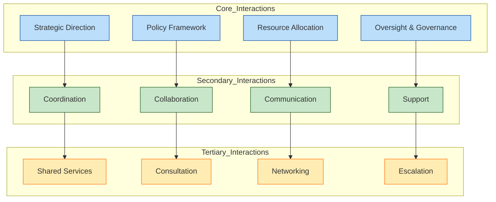

### 📊 Unit Relationship Strength Matrix

| Unit Type | Strategic | Operational | Resource | Information | Risk |
|-----------|:---------:|:-----------:|:--------:|:-----------:|:----:|
| **Executive** | ●●●●● | ●●● | ●●●●● | ●●●● | ●●●●● |
| **Advisory** | ●●●●● | ● | ●● | ●●●●● | ●●●● |
| **Revenue** | ●●●● | ●●●●● | ●●●● | ●●● | ●●● |
| **Product** | ●●●● | ●●●●● | ●●●● | ●●●● | ●●● |
| **Operations** | ●●● | ●●●●● | ●●● | ●●● | ●●● |
| **Corporate** | ●●●● | ●●● | ●●●●● | ●●●● | ●●●● |
| **Infrastructure** | ●● | ●●●● | ●●● | ●● | ●●●●● |
| **Knowledge** | ●●● | ●● | ●●● | ●●●●● | ●● |

*Key: ● Very Low, ●● Low, ●●● Moderate, ●●●● High, ●●●●● Very High*

### 🔄 Information Flow Between Units
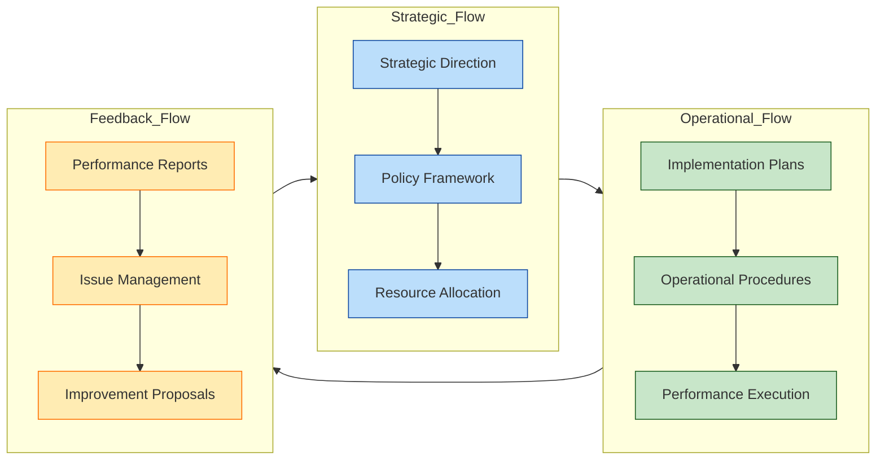

## Cross-Unit Integration
### Control Framework
- Compliance monitoring through [[frameworks/compliance_framework|compliance_framework]]
- Policy management via [[systems/policy_management_system|policy_management_system]]
- Standards enforcement through [[frameworks/standards_framework|standards_framework]]
- Ethics management via [[frameworks/ethics_framework|ethics_framework]]
- Investigation management through [[systems/investigation_management_system|investigation_management_system]]

### 🔄 Control Framework Architecture
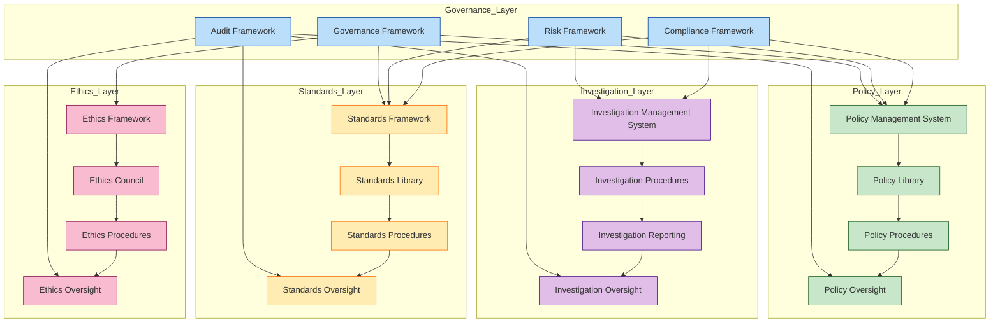

## 📊 Unit Performance Framework

### Key Performance Indicators by Unit Type
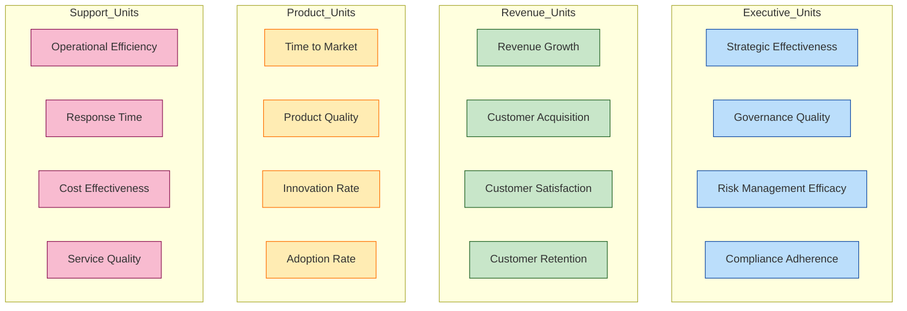

### 📈 Unit Performance Metrics Matrix

| Unit Category | Strategic Metrics | Operational Metrics | Financial Metrics | Customer Metrics | Innovation Metrics |
|---------------|-------------------|---------------------|-------------------|------------------|-------------------|
| **Executive** | Strategic Objective Achievement, Governance Effectiveness | Management Effectiveness, Process Compliance | Financial Target Achievement, Budget Management | Stakeholder Satisfaction, Board Confidence | Strategic Innovation, Market Position |
| **Revenue** | Market Share Growth, Pipeline Development | Sales Cycle Efficiency, Marketing ROI | Revenue Growth, Profit Margin | Customer Satisfaction, NPS | Product-Market Fit, Pricing Innovation |
| **Product** | Product Strategy Alignment, Roadmap Completion | Development Velocity, Quality Metrics | R&D ROI, Product Profitability | User Satisfaction, Feature Adoption | Patent Generation, Technology Leadership |
| **Operations** | Operational Excellence, Service Reliability | Process Efficiency, Error Rates | Cost Optimization, Operational ROI | Service Level Achievement, Response Time | Process Innovation, Automation Rate |
| **Corporate** | Policy Compliance, Risk Management | Service Delivery, Operational Support | Budget Management, Cost Control | Internal Customer Satisfaction, Service Quality | Improved Methods, Digital Transformation |
| **Infrastructure** | Security Posture, Facility Effectiveness | Uptime, Incident Response | Infrastructure TCO, Investment ROI | Resource Availability, Service Experience | Security Innovation, Infrastructure Evolution |
| **Knowledge** | Capability Development, Knowledge Transfer | Training Completion, Knowledge Access | Training ROI, Development Cost | Learner Satisfaction, Capability Improvement | Learning Innovation, Knowledge Creation |

## 🔄 Unit Life Cycle Management 

### Unit Evolution Stages
```mermaid
stateDiagram-v2
    [*] --> Formation
    
    Formation --> Establishment
    
    state Establishment {
        [*] --> Scoping
        Scoping --> Staffing
        Staffing --> Chartering
        Chartering --> [*]
    }
    
    Establishment --> Growth
    
    state Growth {
        [*] --> Capability
        Capability --> Process
        Process --> Integration
        Integration --> [*]
    }
    
    Growth --> Maturity
    
    state Maturity {
        [*] --> Optimization
        Optimization --> Innovation
        Innovation --> Leadership
        Leadership --> [*]
    }
    
    Maturity --> Transformation
    
    state Transformation {
        [*] --> Assessment
        Assessment --> Redesign
        Redesign --> Realignment
        Realignment --> [*]
    }
    
    Transformation --> [*]
```

### 📋 Unit Governance Maturity Model

| Dimension | Level 1: Initial | Level 2: Developing | Level 3: Defined | Level 4: Managed | Level 5: Optimizing |
|-----------|------------------|---------------------|------------------|------------------|---------------------|
| **Leadership** | Ad hoc leadership | Defined leadership roles | Established leadership team | Effective leadership practices | Strategic leadership influence |
| **Processes** | Informal processes | Documented basic processes | Standardized processes | Measured and controlled processes | Continuously improving processes |
| **Governance** | Minimal controls | Basic governance structure | Defined governance framework | Integrated governance system | Proactive governance optimization |
| **Resources** | Resource constraints | Resource allocation | Resource optimization | Strategic resource management | Maximized resource value |
| **Documentation** | Minimal documentation | Basic documentation | Comprehensive documentation | Living documentation | Knowledge-centered documentation |
| **Measurement** | Few or no metrics | Basic metrics | Comprehensive metrics | Metrics-driven decisions | Predictive measurement system |
| **Integration** | Siloed operations | Basic integration | Defined interfaces | Seamless integration | Synergistic integration |

---
Last Updated: 2024-03-31
Version: 1.3
Maintained by: [[organization_admin]]
Security Level: [[internal]]
Document Status: [[active]]
Review Cycle: Quarterly
Next Review: 2024-06-30

### Security Operations Center (SOC)
The Security Operations Center serves as the central coordination point for all security activities across physical, digital, and cognitive domains.

#### SOC Functions
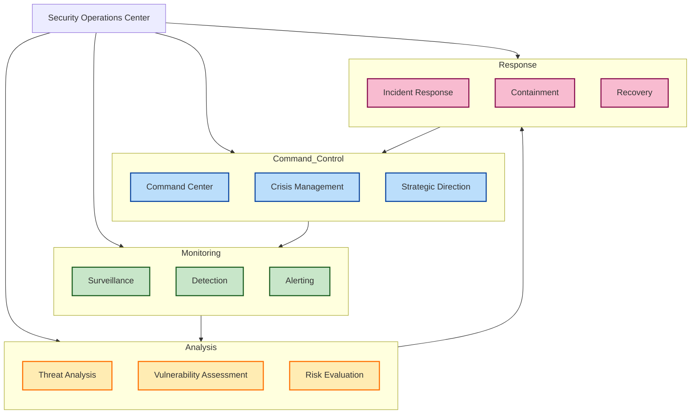

#### Security Operations Workflow
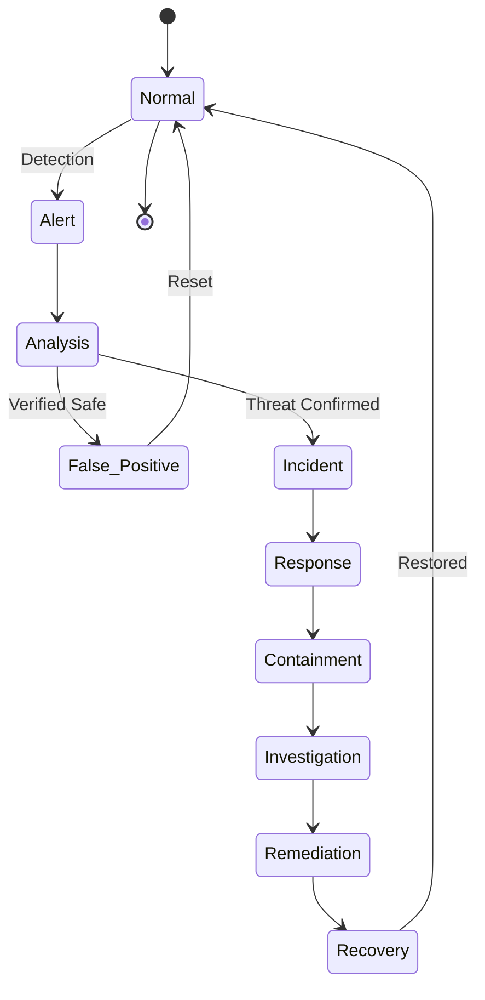

### Integrated Defense Strategy

#### Defense-in-Depth Model
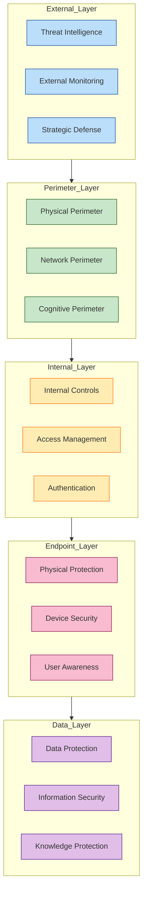

#### Security Risk Response Matrix

| Risk Level | Physical Response | Digital Response | Cognitive Response | Integrated Response |
|------------|------------------|------------------|-------------------|---------------------|
| **Critical** | Site lockdown, Armed response | System isolation, Emergency patching | Cognitive lockdown, Counter-narratives | Crisis activation, All-domain response |
| **High** | Enhanced security, Access restrictions | Network segmentation, Threat hunting | Narrative monitoring, Strategic comms | Security escalation, Cross-domain controls |
| **Medium** | Increased patrols, Access validation | Enhanced monitoring, Targeted scanning | Awareness campaigns, Pattern analysis | Targeted response, Domain-specific actions |
| **Low** | Normal security, Standard access | Routine monitoring, Regular updates | Basic awareness, Normal comms | Standard operations, Routine measures |
| **Minimal** | Baseline security | Automated controls | Background awareness | Passive monitoring |

### Security Training and Awareness
The Security unit manages comprehensive security training and awareness programs across all security domains:

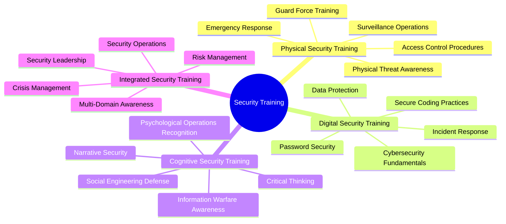

### Security Key Performance Indicators

#### 📊 Security Performance Dashboard
```mermaid
graph TD
    classDef metric fill:#bbdefb,stroke:#0d47a1
    classDef indicator fill:#c8e6c9,stroke:#1b5e20
    classDef status fill:#ffecb3,stroke:#ff6f00

    subgraph Security_Metrics
        M1[Incidents Detected]:::metric
        M2[Response Time]:::metric
        M3[Resolution Rate]:::metric
        M4[Control Effectiveness]:::metric
    end

    subgraph Key_Indicators
        KI1[Threat Landscape]:::indicator
        KI2[Vulnerability Status]:::indicator
        KI3[Risk Posture]:::indicator
        KI4[Security Maturity]:::indicator
    end

    subgraph Security_Status
        S1[Physical Security]:::status
        S2[Digital Security]:::status
        S3[Cognitive Security]:::status
        S4[Overall Posture]:::status
    end

    Security_Metrics --> Key_Indicators
    Key_Indicators --> Security_Status
```

### Security Strategic Initiatives
1. [[integrated_security_platform]] - Unified security management across all domains
2. [[next_generation_monitoring]] - Advanced threat detection and monitoring
3. [[cognitive_defense_enhancement]] - Strengthened cognitive and information security
4. [[zero_trust_architecture]] - Comprehensive zero trust implementation
5. [[security_automation]] - Enhanced security automation and orchestration

## Unit Index

*   [Administration](Administration/README.md)
*   [AdvisoryBoard](AdvisoryBoard/README.md)
*   [Audit](Audit/README.md)
*   [BoardOfDirectors](BoardOfDirectors/README.md)
*   [BusinessDevelopment](BusinessDevelopment/README.md)
*   [Compliance](Compliance/README.md)
*   [CustomerSupport](CustomerSupport/README.md)
*   [Development](Development/README.md)
*   [Education](Education/README.md)
*   [EthicsAdvisoryBoard](EthicsAdvisoryBoard/README.md)
*   [Executive](Executive/README.md)
*   [ExecutiveCommittee](ExecutiveCommittee/README.md)
*   [Facilities](Facilities/README.md)
*   [Finance](Finance/README.md)
*   [Governance](Governance/README.md)
*   [HumanResources](HumanResources/README.md)
*   [InformationTechnology](InformationTechnology/README.md)
*   [Innovation](Innovation/README.md)
*   [Intelligence](Intelligence/README.md)
*   [KnowledgeManagement](KnowledgeManagement/README.md)
*   [Legal](Legal/README.md)
*   [Marketing](Marketing/README.md)
*   [MarketingCommunications](MarketingCommunications/README.md)
*   [Operations](Operations/README.md)
*   [OrganizationalDevelopment](OrganizationalDevelopment/README.md)
*   [ProductManagement](ProductManagement/README.md)
*   [QualityAssurance](QualityAssurance/README.md)
*   [Research](Research/README.md)
*   [ResearchDevelopment](ResearchDevelopment/README.md)
*   [RiskAdvisoryBoard](RiskAdvisoryBoard/README.md)
*   [RiskManagement](RiskManagement/README.md)
*   [Sales](Sales/README.md)
*   [ScientificAdvisoryBoard](ScientificAdvisoryBoard/README.md)
*   [Security](Security/README.md)
*   [Strategy](Strategy/README.md)
*   [SupplyChain](SupplyChain/README.md)
*   [TechnologyAdvisoryBoard](TechnologyAdvisoryBoard/README.md)
*   [TrainingDevelopment](TrainingDevelopment/README.md)

